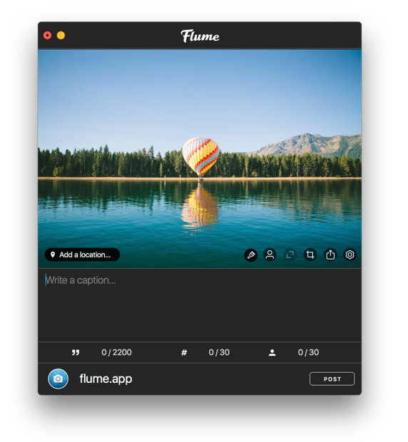
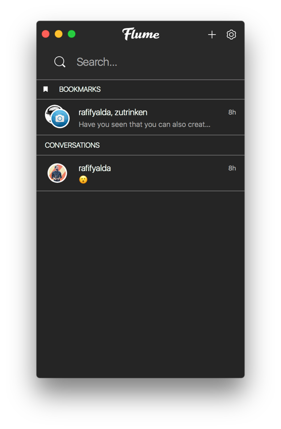
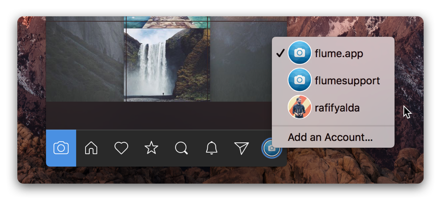

# Overview

Flume for Mac is a beautiful Instagram client for macOS Yosemite 10.10 and above. Flume makes browsing Instagram faster, and more efficient than any other platform. With support for [uploading](views/upload.md), [direct messaging](views/conversations/), [sharing](views/sharing.md), [editing](views/editing.md), [promoting](views/profile/businessprofiles/promote.md) and much more, Flume is the best way to use Instagram for both casual and professional Instagram users. 

## Upload directly from your Mac

With support for cropping, tagging, locations, filters, adjustments, cover images and social network sharing, Flume's upload support is comprehensive and complete. [Learn more.](views/upload.md)

## Chat to customers, fans, friends

Use the benefit of your dedicated keyboard to quickly respond to customers and share items with friends with complete Instagram Direct support. [Learn more.](views/conversations/)

## Manage multiple accounts

Switching between your personal and business accounts is a breeze. With comprehensive [Keyboard Shortcuts](misc/keyboard-shortcuts.md), you can switch accounts from anywhere with a simple keypress. [Learn more.](preferences/accounts.md)

