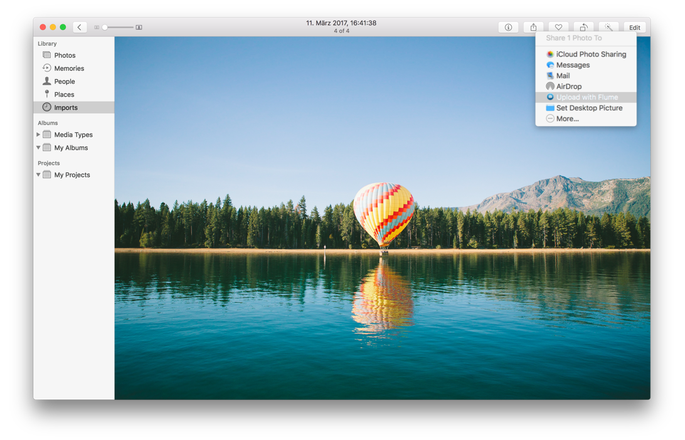
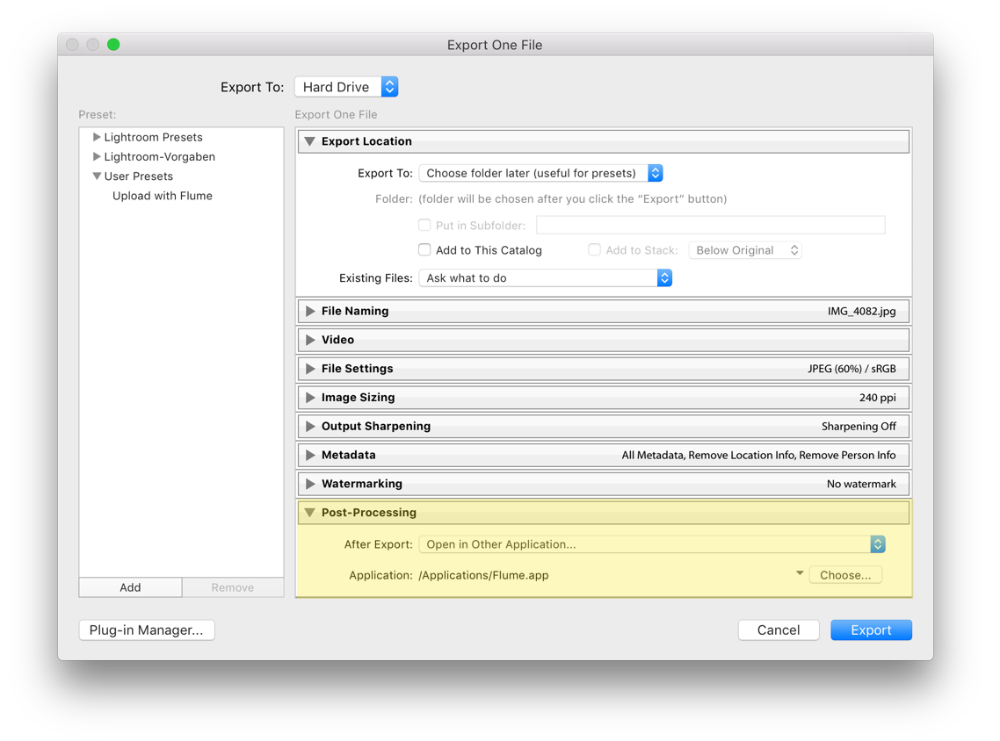

# Integrations

## Share Extension

As of Flume 2.8, support for macOS [Sharing Extensions](https://support.apple.com/kb/PH18826) has been added. This allows you to share from any place in macOS, and in macOS apps that support Share Extensions.

In order to use Flume's Share Extension, it must be enabled from `System Preferences > Extensions` before it will appear in Share menus.



## Finder

### System Services

Flume supports macOS Services menu, allow you to right-click any photo/video in Finder and begin the upload process.

See [this article](http://www.macworld.com/article/1163996/software-utilities/how-to-use-services-in-mac-os-x.html) for an introduction to macOS System Services.

### "Open with…"

Flume also supports opening images and videos directly, though in most instances the default application for opening these files would be Preview. To open an image or video with Flume, right-click on it and use the `Open with…` menu item.

If Flume is not currently open, it will open and present you with an [Upload](../views/upload.md) window with the selected file/s ready to post.

### Drag to Dock

Flume handles photos and videos dragged to its [Dock](glossary.md#dock) icon, as well as entire folders \(a maximum limit of 10 files at a time is applied\). You will be asked if each file is a separate [upload](../views/upload.md) or if you wish to create a single [carousel post.](../views/upload.md#carousel-posts)

## Photos

Starting with macOS Yosemite 10.10.3, Apple ships all Macs with [Photos](https://support.apple.com/photos) \(the successor to iPhoto\).

To share from Photos to Flume, either use the [Share Extension](integrations.md#share-extension), or drag-and-drop photos and videos directly on to the Flume upload window.


It is not possible to drag-and-drop photos and videos from Photos onto the Flume [Dock](glossary.md#dock) icon. Drop the items onto an empty [Upload](../views/upload.md) window, or use the [Share Extension](integrations.md#share-extension) _\(recommended\)_.


## Adobe Lightroom

To send content from Lightroom into Flume, you can create a new [Export Preset](https://helpx.adobe.com/lightroom/help/export-presets-settings-plug-ins.html) with the following options:




The only necessary step is that listed under "Post-Processing", the options for where to place the exported file are customizable to your workflow.


## Adobe Photoshop

Unlike Lightroom, Photoshop does not offer a simple way to export content into a post-processing application. However, using [AppleScript](https://en.wikipedia.org/wiki/AppleScript), it is still possible to automate the export into Flume.

The following AppleScript can be used to export the currently open document in Adobe Photoshop CC 2017 into Flume. This can be imported into [AppleScript Editor](https://en.wikipedia.org/wiki/AppleScript_Editor), [Automator](https://en.wikipedia.org/wiki/List_of_macOS_components#Automator), or other tools that accept AppleScript input.

```text
set filePath to "/tmp/flume-temp-upload.png"

tell application "Adobe Photoshop CC 2017"
    set saveOptions to {class:PNG save options}
    save current document in file filePath as PNG with options ¬
        saveOptions appending lowercase extension with copying
end tell

try
    set command to "open -a /Applications/Flume.app " & quoted form of filePath
    do shell script command
end try
```

For Adobe Photoshop CC 2018 and later, you can use the macOS [Share Extension.](integrations.md#share-extension)

