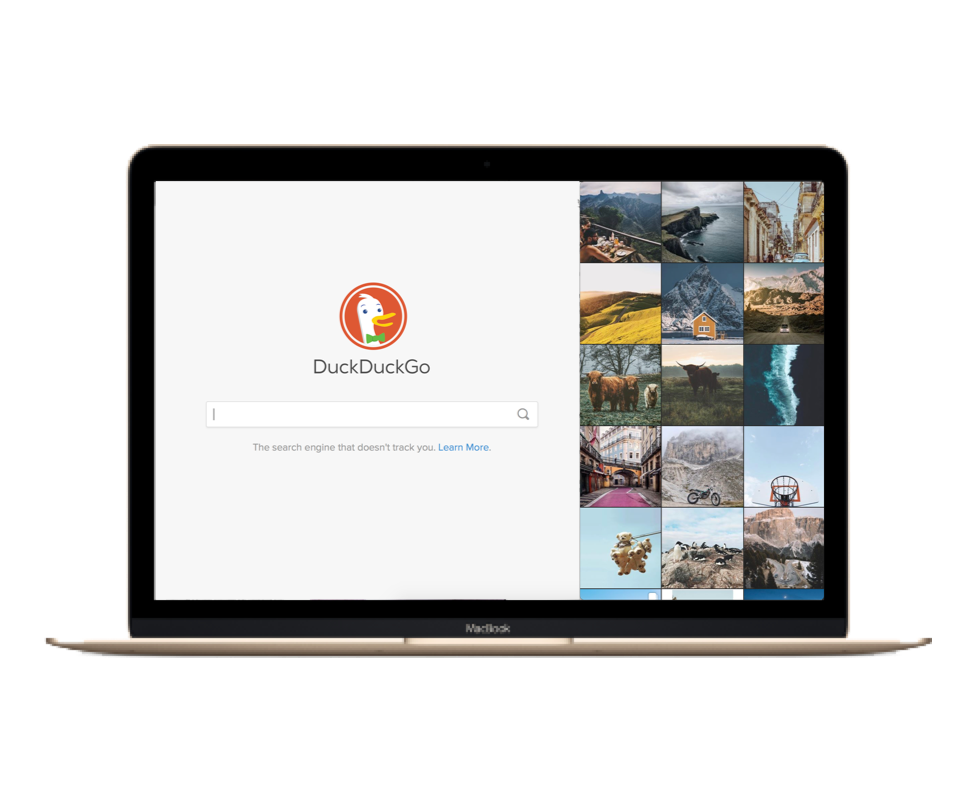

# Split-View Mode

Flume does not offer a full-screen view for various reasons. You may however use the macOS [Split-View feature](https://support.apple.com/en-us/HT204948) \(macOS 10.11 or later\) to use Flume and another application side-by-side.

## Activating Split-View

To activate Split View mode:

1. Hold the `⌥ OPTION` key while long-pressing/clicking on the main window's zoom button \(the green button in the [title bar](glossary.md#title-bar) area\)
2. You will be able to choose on which side of your display you would like to keep Flume.
3. Select another application that will be displayed beside Flume in Split-View full-screen mode.

