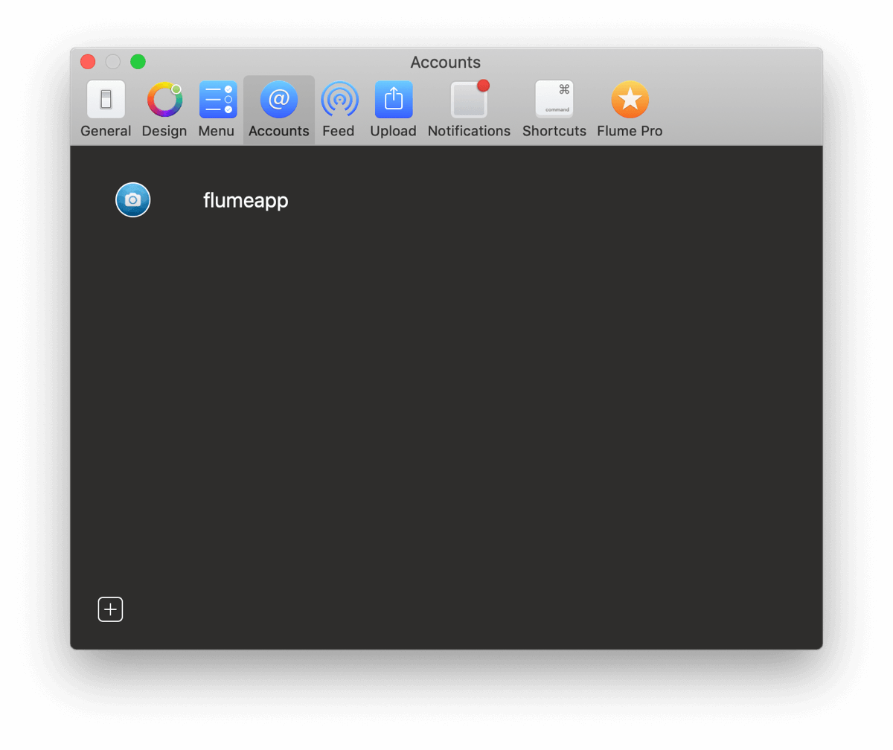

# Accounts Preferences

## Adding an Account 

To add an additional account, click on the  button.

The login window will appear, and after successfully logging in, the active account will be switched to the new account.


Adding multiple accounts requires a [Flume Pro](flumepro.md) licence.


## Switching an Account 

To switch between logged in accounts:

* Select the account from the `Accounts` [menu bar](../misc/glossary.md#menu-bar) menu or use the corresponding [keyboard shortcut.](../misc/keyboard-shortcuts.md)
* Long-press/click on your avatar in the [Flume main menu.](menu/)
* Click or long-press/click on your avatar on the [upload](../views/upload.md) window.

## Removing an Account

To remove an account, simply log out of the account.

* Use the `Log Out…` [menu bar](../misc/glossary.md#menu-bar) item when logged in with the account you wish to remove. If you are logged in with multiple accounts, use the `Log Out of @username` [menu bar](../misc/glossary.md#menu-bar) item instead.

To remove all accounts:

* Use the `Log Out of All Accounts…` [menu bar](../misc/glossary.md#menu-bar) item. This menu item will only be visible if you are logged in with more than one account.

