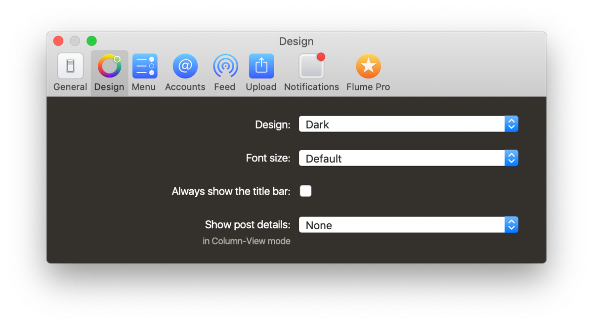
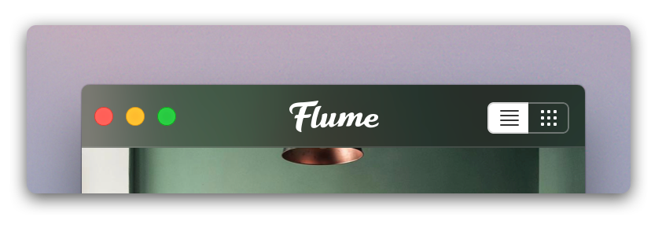

# Design Preferences

## Design

| Option | Explanation |
| :--- | :--- |
| `System Appearance` | This item is only available on macOS Mojave \(10.14\) and will match the macOS preference for [Dark Mode.](https://support.apple.com/en-us/HT208976) Additionally, the macOS "accent colour" will be used for various UI elements in Flume \(eg. buttons, drop-down lists\). |
| `Dark` | The user interface will use a darker background, with lighter text. |
| `Light` | The user interface will use a lighter background, with darker text. |

## Font Size

The font size preference can also be adjusted at any time in Flume via the [keyboard shortcuts](../misc/keyboard-shortcuts.md) `⌘+` and `⌘-`.

| Option | Explanation |
| :--- | :--- |
| `Default` | Text elements will use the default font sizes as recommended by the [macOS Human Interface Guidelines.](https://developer.apple.com/library/content/documentation/UserExperience/Conceptual/OSXHIGuidelines/index.html) |
| `Larger` | Increases the text sizes from the default by 1pt. |
| `Largest` | Increases the text sizes from the default by 2pt. |

## Always Show the Title Bar

Enables or disables showing the Flume [title bar](../misc/glossary.md#title-bar) in [feed](../views/feed.md) and [likes](../views/likes.md) views. When disabled, [`Show the menu:`](design.md#show-the-menu) is set to `On Hover` and [`Show post details:`](design.md#show-media-details) is set to `None`, Flume will display content edge-to-edge with no visible chrome \(_default setting_\).

## Show Post Details

Customizes the amount of details to show about media when in column views \([feed](../views/feed.md), [likes](../views/likes.md) and [profile](../views/profile/)\). See [feed](../views/feed.md) for visual examples.

| Option | Explanation |
| :--- | :--- |
| `None` | Does not display any additional information about posts \(_default_\). |
| `All` | Displays the author, location \(if applicable\), caption, timestamp, and buttons to like, comment, share and save the post. This option resembles the official Instagram application. |
| `Compact` | Displays the author, location \(if applicable\) and the posting date. |
| `On Hover` | Displays the author, location \(if applicable\) and posting date, overlaid on the post when the mouse hovers directly above. When the mouse exits, the details are hidden. |

