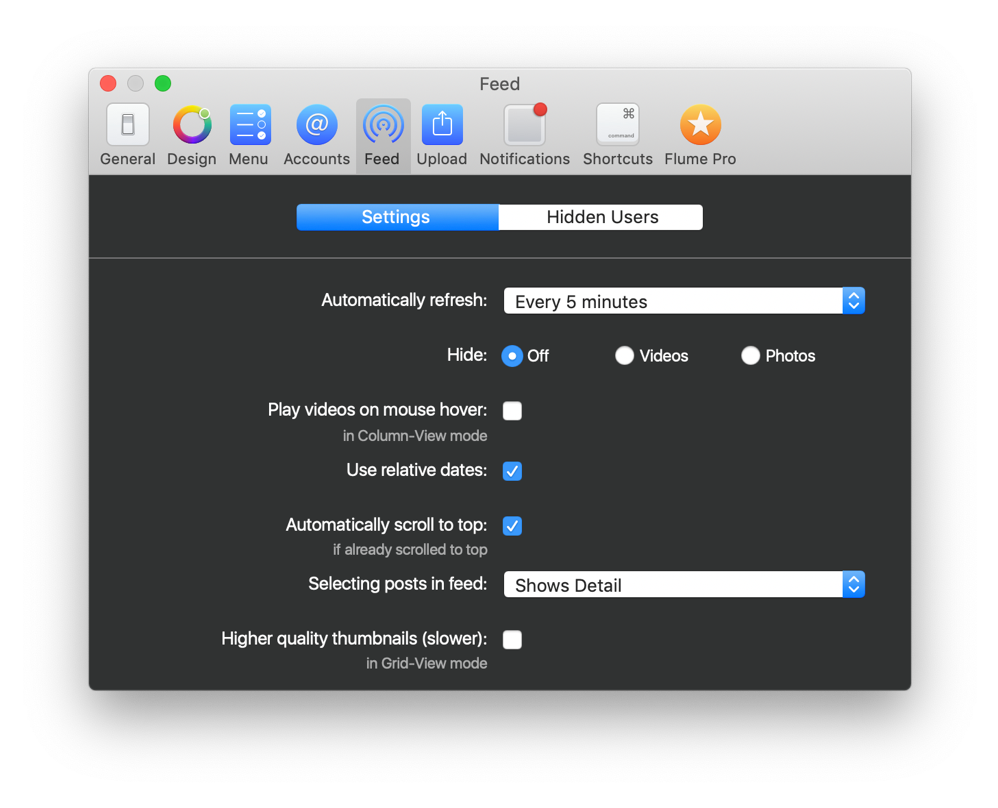

# Settings

## Automatically Refresh

Choose a refresh interval to automatically refresh your [feed](../../views/feed.md), [activity](../../views/activity.md) and [notifications](../notifications.md) badge when Flume is open. Note that the Flume window does not need to be visible, but you must be [logged in](../../views/login.md) to an account.

If using Flume with [multiple accounts](../accounts.md#adding-an-account-), the refresh will only occur for the currently active account.

## Hide

Enable or disable displaying photos or videos in Flume. When enabled, all photos or videos will be filtered from the [feed](../../views/feed.md), [likes](../../views/likes.md) and [explore](../../views/explore.md) views. Photo or videos will still be displayed on [profiles.](../../views/profile/)

## Use Relative Dates

Will toggle the display of dates for posts between relative \(`2 hours ago`\), or absolute \(`Saturday, April 1st, 2017 13:37`\). The exact format of absolute dates will depend on your [macOS Language & Region](https://support.apple.com/kb/PH18445) preferences.

## Automatically Scroll to Top

Enable or disable fixing the scroll position to the first item \(top\) whenever an [automatic refresh](settings.md#automatically-refresh) triggers, or when [manually refreshing.](../../misc/keyboard-shortcuts.md) This option only applies when viewing the [feed](../../views/feed.md) in [column-view.](../../views/feed.md#view-modes)

## Selecting Posts in Feed

Customize the action that will occur when clicking on posts in the [feed.](https://github.com/flumeapp/help.flumeapp.com/tree/1577f0ffdac2f11d862e55096c48747d3c60ea48/views/Feed.md)

| Option | Explanation |
| :--- | :--- |
| `Shows Detail` | Clicking on a post will display the post's [details](../../views/detailview.md) \(comments, likes, and user tags\) \(_default setting_\). |
| `Shows Author` | Clicking on a post will display the author's [profile.](../../views/profile/) |

## Higher Quality Thumbnails \(Slower\)

Enable or disable the option to download higher resolution thumbnail images when viewing content in a [grid.](../../views/feed.md#view-modes) As the higher resolution images are larger in filesize, they can take longer to download and appear. 

