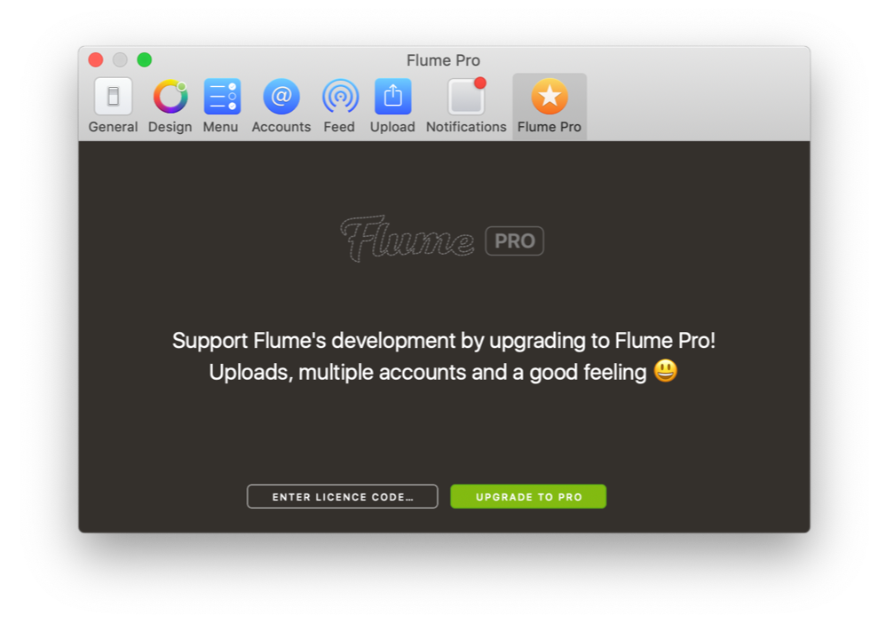
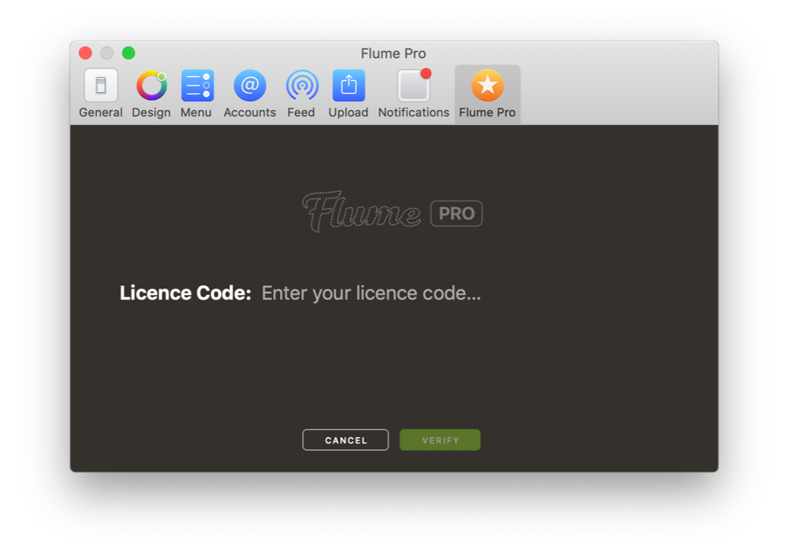
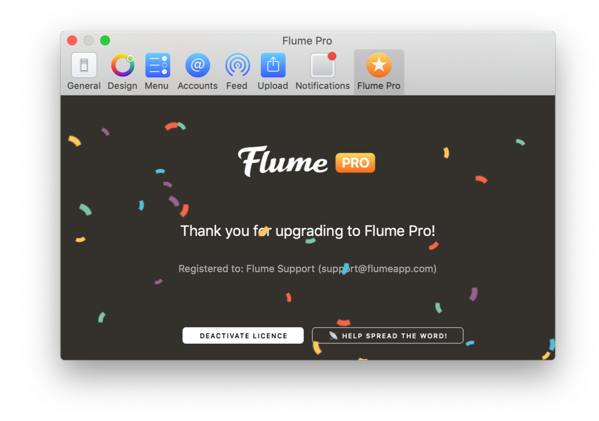

# Flume Pro Preferences

Flume Pro is a one-time in-app purchase, our way of sustaining the development of Flume. You can read more about the introduction of Flume Pro on our [blog.](http://blog.flumeapp.com/post/145212126271/introducing-flume-20-and-flume-pro)


[As of April 6th 2017, Flume is no longer available via the Mac App Store.](https://support.flumeapp.com/article/16-why-is-flume-not-on-the-mac-app-store) If you purchased Flume Pro via the Mac App Store, please see how to [migrate your purchase.](flumepro.md#migrating-your-mac-app-store-purchase)



Flume for Mac via [Setapp](http://blog.flumeapp.com/post/156342148286/flume-comes-to-setapp) includes Flume Pro as standard and does not require any additional upgrade purchase, as it is covered by Setapp's monthly subscription fee.


## Flume Pro Features

Features that are unlocked via Flume Pro display a  badge.

Benefits of Flume Pro:

* [Upload photos/videos.](../views/upload.md)
* [Add multiple accounts.](accounts.md) You can add and easily switch between as many accounts as you like.
* A good feeling :\)

For more information on Flume Pro, please see the [Flume Pro FAQ.](https://support.flumeapp.com/section/10-flume-pro)

## Upgrading to Flume Pro

To upgrade to Flume Pro:

1. Click on the  button in the Menu Bar and select `Purchase a Flume Pro Licence…`
2. Click on the `Flume Pro` tab \(if not selected\), then click on `Upgrade to Pro`

You can also purchase Flume Pro by [visiting our website](https://flumeapp.com) and clicking on the `Upgrade` button.

Upon a successful purchase, you will be presented with a thank you screen. Your licence code will be emailed to you, as well as your purchase receipt.

If you do not receive your licence code, please check your Spam folders. If you made a mistake with your email address, [please contact us.](https://flumeapp.com/support/)


Licence codes can be activated on up to 5 Macs \(personal-use\)


## Activating Flume Pro

In your Flume Pro Licence email, a unique activation link is included. Click this link to automatically enter and verify your licence code in Flume. Alternatively, you can activate your licence manually.

To activate your Flume Pro licence manually:

1. Click on the  button in the [Menu Bar](../misc/glossary.md#menu-bar) and select `Activate Licence…`
2. Click on the `Flume Pro` tab \(if not selected\).
3. Click the `Enter Licence Code…` button.
4. Enter your licence code that you received via email.  
5. Click `Verify`. If your licence has not exhausted all its activations, your name and email address will appear.  
6. Click `Activate`  

## Deactivating Flume Pro

To deactivate your Flume Pro licence:

1. Click on the  button in the [Menu Bar](../misc/glossary.md#menu-bar) and select `Deactivate Licence…`
2. Click on the `Flume Pro` tab \(if not selected\).
3. Click the `Deactivate Licence` button.

## Recovering Lost Licence

If you've deleted your licence code email, you can [recover it from our website.](https://flumeapp.com/pro/lost/)

## Migrating Your Mac App Store Purchase

If you have previously purchased Flume Pro via the Mac App Store, you will need to migrate it to a licence code.

To migrate your Mac App Store purchase, [please follow our instructions on our Support Portal.](https://flumeapp.com/appstore/)

To manually open the Licence Migrator Tool:

1. Click on the  button in the [Menu Bar](../misc/glossary.md#menu-bar) and select `Migrate Mac App Store Purchase`
2. Drag the App Store version of Flume onto the Licence Migrator Tool window and follow the prompts.

## Need Help?

If you are having trouble purchasing or activating Flume Pro, please visit our [Support Portal](http://support.flumeapp.com) to contact us.

