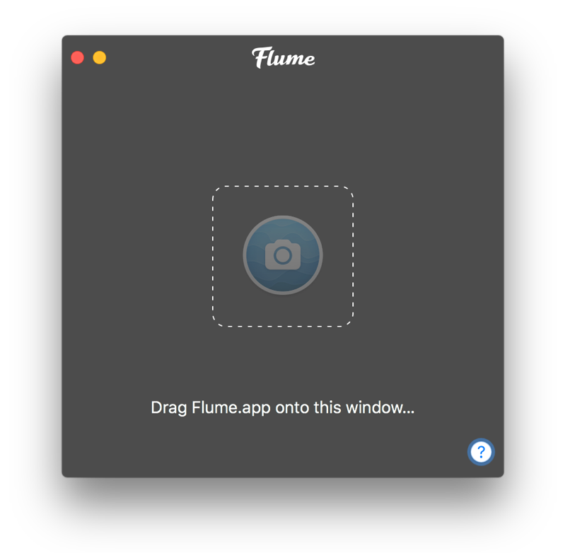

# Flume Pro Preferences

Flume Pro is a software upgrade for Flume that unlocks additional features, as well as helps sustain future development, bug-fixes, and customer support. Features that are unlocked via Flume Pro display a  badge, which will disappear when you activate a Flume Pro licence.

The features unlocked with a Flume Pro licence purchase \(at time of writing\) include:

* [Upload photos, videos, and carousel posts](../views/upload.md)
* [Add multiple accounts](accounts.md)

For more information on Flume Pro, please see the [Flume Pro FAQ.](https://support.flumeapp.com/section/10-flume-pro)


[As of April 6th 2017, Flume is no longer available via the Mac App Store.](https://support.flumeapp.com/article/16-why-is-flume-not-on-the-mac-app-store) If you purchased Flume Pro via the Mac App Store, please see how to [migrate your purchase.](flumepro.md#migrating-your-mac-app-store-purchase)



Flume via [Setapp](http://blog.flumeapp.com/post/156342148286/flume-comes-to-setapp) includes Flume Pro's features as standard and does not require any additional upgrade Flume Pro licence purchase or activation. The instructions on this page are therefore only for direct customers.


## Upgrading to Flume Pro

To upgrade to Flume Pro:

1. Click on the  button in the [menu bar](../misc/glossary.md#menu-bar) and select `Purchase a Flume Pro Licence…`
2. Click on the `Flume Pro` tab \(if not selected\), then click on `Upgrade to Pro`

You can also purchase Flume Pro by [visiting our website](https://flumeapp.com) and clicking on the `Upgrade` button.

Upon a successful purchase, you will be presented with a thank you screen. Your licence code will be emailed to you, as well as your purchase receipt.

If you do not receive your licence code, please check your Spam folders. If you made a mistake with your email address, [please contact us.](https://flumeapp.com/support/)


Licence codes can be activated on up to 5 Macs \(personal-use\)


## Activating Flume Pro

In your Flume Pro licence email, a unique activation link is included. Click this link to automatically enter and verify your licence code in Flume. Alternatively, you can activate your licence manually.

To activate your Flume Pro licence manually:

1. Click on the  button in the [menu bar](../misc/glossary.md#menu-bar) and select `Activate Licence…`
2. Click on the `Flume Pro` tab \(if not selected\).
3. Click the `Enter Licence Code…` button.
4. Enter your licence code that you received via email \(tip: copy and paste\).
5. Click `Verify`. If your licence has not exhausted all its activations, your name and email address will appear.
6. Click `Activate`

## Deactivating Flume Pro

To deactivate your Flume Pro licence:

1. Click on the  button in the [menu bar](../misc/glossary.md#menu-bar) and select `Deactivate Licence…`
2. Click on the `Flume Pro` tab \(if not selected\).
3. Click the `Deactivate Licence` button.

## Recovering Lost Licence

If you've deleted your licence code email, you can [recover it from our website.](https://flumeapp.com/pro/lost/)

## Migrating Your Mac App Store Purchase

If you have previously purchased Flume Pro via the Mac App Store, you will need to migrate it to a licence code.

To migrate your Mac App Store purchase, [please follow our instructions on our Support Portal.](https://flumeapp.com/appstore/)

To manually open the Licence Migrator Tool:

1. Click on the  button in the [menu bar](../misc/glossary.md#menu-bar) and select `Migrate Mac App Store Purchase`
2. Drag the App Store version of Flume onto the Licence Migrator Tool window and follow the prompts.

## Need Help?

If you are having trouble purchasing or activating Flume Pro, please visit our [Support Portal.](http://support.flumeapp.com)

