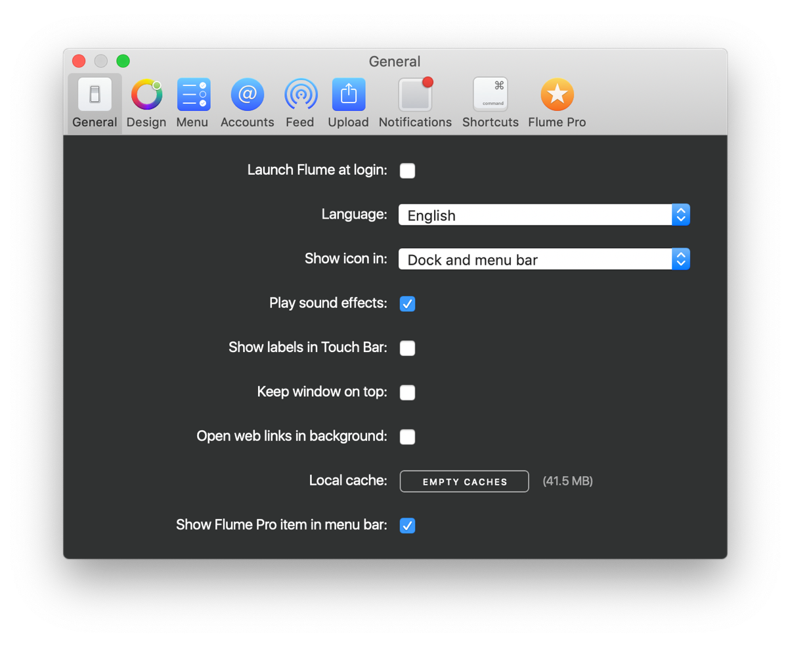
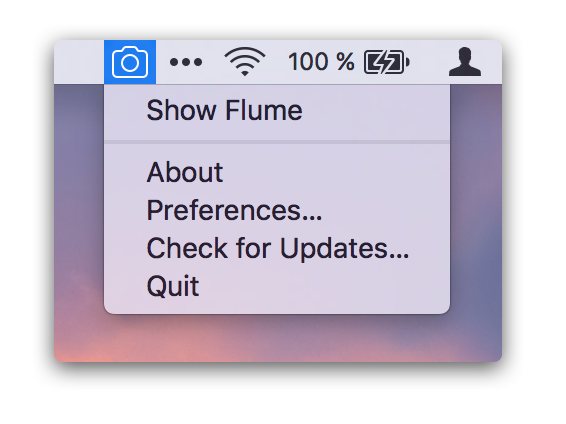

# General Preferences

## Launch Flume at Login

Allows you to ensure Flume launches every time you restart your Mac or log-in to your user account.

## Language

Flume supports the following languages: 

* Arabic
* Chinese \(Simplified\)
* Chinese \(Traditional\)
*  Czech
* Danish
* Dutch
* English
* French
* German
* Greek
* Indonesian
* Italian
* Japanese
* Korean
* Malay
* Norwegian
* Polish
* Portuguese
* Portuguese \(Brazilian\)
* Russian
* Spanish
* Swedish
* Thai
* Turkish
* Ukrainian
* Vietnamese

Adjusting the language will adjust all user-interface elements, as well as content that is returned from Instagram directly, such as the language of [activity notifications](../views/activity.md), and error messages.

## Show Icon in

Choose between three options:

| Option | Explanation |
| :--- | :--- |
| `Dock only` | The Flume icon will be displayed in the [macOS Dock](../misc/glossary.md#dock) when running. |
| `Dock and menu bar` | The Flume icon will be displayed in the [macOS Dock](../misc/glossary.md#dock) when running, and in the [menu bar's](../misc/glossary.md#menu-bar) status item area. |
| `Menu bar only` | The Flume icon will be displayed only in the [menu bar's](../misc/glossary.md#menu-bar) status item area. |

Clicking on the status bar icon will toggle the windows front-most status, similar to the [`Global show/hide window:`](general.md#global-showhide-window) keyboard shortcut.


To access Flume's preferences in "Menu bar only" mode, right-click on Flume's icon in the [Menu Bar.](../misc/glossary.md#menu-bar)


## Play Sound Effects

Enable or disable user-interface sound effects \(such as when refreshing content with the "pull-to-refresh" method, or clicking on buttons\).

## Show Labels in Touch Bar

Enable or disable labels for buttons that appear in the [Touch Bar](https://support.apple.com/en-us/HT207055). Disabling this option will allow more buttons to be visible in the Touch Bar. [Learn more.](../misc/touchbar.md)

## Keep Window on Top

Enable or disable Flume's windows to float above all other windows on the screen. [Large preview](../views/largepreview.md) windows will display above all other Flume windows regardless of this option.

## Open Web Links in Background

When clicking on web links in comments, captions, messages, or using the `Open in browser…` menu item, the default web-browser will open the selected link. When this option is enabled, the web-browser opens the link in the background and Flume does not lose focus.

## Global Show/Hide Window

Allows you to configure a custom [keyboard shortcut](../misc/keyboard-shortcuts.md) that can be triggered whenever Flume is open, that will display or hide the Flume main window quickly. If Flume is not currently open, no action will be performed.

When the [`Show icon in:`](general.md#show-icon-in) option is set to `Menu bar only` or `Dock and menu bar`, clicking on the status bar icon will also toggle the windows front-most status.

## Local Cache

Displays the current size of the local database and image cache. This cache is automatically cleared by Flume when it reaches 300MB, when all accounts are logged out, or manually by pressing the `Empty Caches` button.

## Show Flume Pro Item in Menu Bar

Toggles the visibility of the  menu item in the macOS [menu bar.](../misc/glossary.md#menu-bar)

