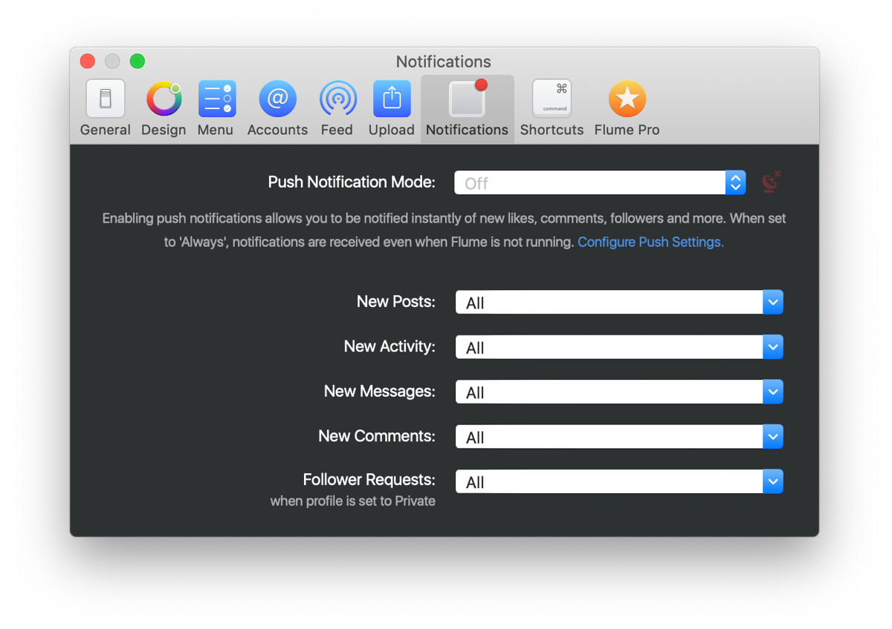

# Notifications Preferences

## Push Notification Mode

Flume can receive Push Notification from Instagram so that you're alerted instantly to new activity. These behave identically to Push Notifications that you receive on your mobile devices.

You can configure which types of Push Notifications you receive, by clicking `Configure Push Settings` to edit your [Push Notification Settings.](https://github.com/flumeapp/help.flumeapp.com/tree/1577f0ffdac2f11d862e55096c48747d3c60ea48/views/profile/pushnotifications.html)

Your connection status to receive Push Notifications from Instagram is displayed via the coloured indicator.


Note that configuring your Push Notification Settings applies to all your mobile devices. It is not possible to receive certain Push Notifications on your Mac with Flume, while receiving other types only on your mobile devices through the Instagram app.


| Option | Explanation |
| :--- | :--- |
| `Off` | Receiving Push Notification is disabled. You will only be notified of new activity when your [automatic refresh interval](feed/#automatic-refresh-interval) elapses. |
| `When Running` | Push Notifications will be delivered, but notifications will only appear if Flume is currently open. |
| `Always` _`(Recommended)`_ | Push Notifications will be delivered at all times, even when Flume is not running. The way you are alerted to new Push Notifications is defined by the notification settings you configure under [New Activity.](notifications.md#new-activity). If you use Flume with multiple accounts, notifications are received for those even when logged in with a different account. |

## Flume Notification Methods

You can be alerted to new notifications in Flume in the following ways:

 **Badge the Dock icon**  - A red indicator will display on the Dock icon. The [Status Bar](general.md#show-icon-in) item will also highlight if it is visible.

 **Show a desktop notification**  - A macOS desktop notification will appear, with actionable items \(eg. to reply to a new message, or to view a new activity notification\).

 **Play an audio alert**  - A short audio sound effect will play. The volume will be set to the current [macOS alert volume.](https://support.apple.com/kb/PH18959)

## New Posts

Whenever the Flume window is not front-most, and new content in the [Feed](../views/feed.md) is downloaded, the notification settings will apply. This usually occurs when the [automatic refresh interval](feed/#automatic-refresh-interval) elapses.

## New Activity

Whenever there is new content on the [Activity](../views/activity.md) tab, the selected notification settings will apply. New activity types include new likes, updated spam reports from Instagram, new friends/contacts that have joined Instagram, copyright breaches and potentially future notification types that Instagram may add in the future. This usually occurs when the [automatic refresh interval](feed/#automatic-refresh-interval) elapses.


New activity notifications for new comments, mentions in comments, and replies to your comments, your settings under [New Comments](notifications.md#new-comments) will apply.


## New Messages

Whenever a new message in an existing [Conversation](../views/conversations/) is received, or a user you follow messages you for the first time, the notification settings will apply. Messages are received in real-time and thus do not depend on the [automatic refresh interval](feed/#automatic-refresh-interval) setting.

## New Comments

Whenever there is new content on the [Activity](../views/activity.md) tab that relates to a new comment, a new mention, or a reply to your comments, the selected notification settings will apply.

## Follower Requests

Whenever a new follower request is received, the notification settings will apply. This usually occurs when the [automatic refresh interval](feed/#automatic-refresh-interval) elapses.


Follower requests are only available if you have a [private profile.](../views/profile/settings/privateprofiles.md)


