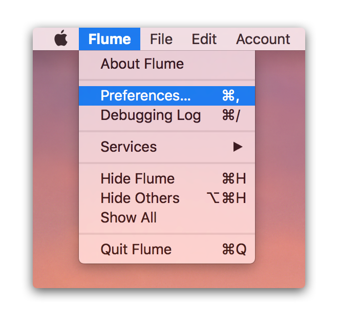
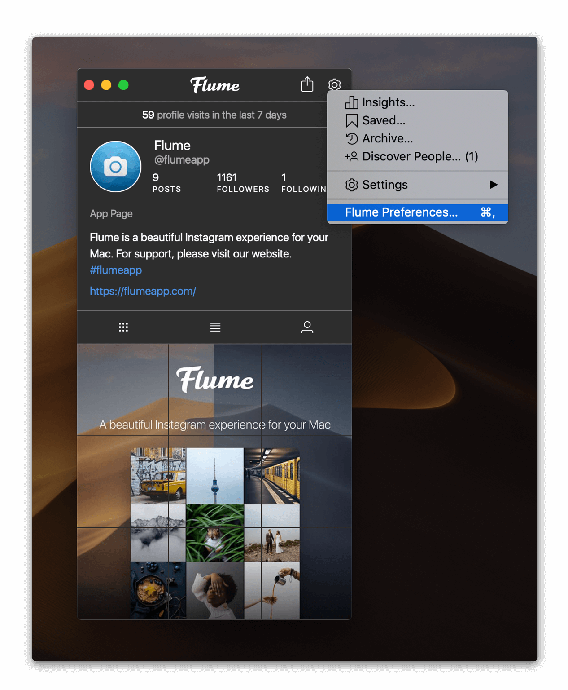

# Accessing Preferences

To access Flume's Preferences, use the macOS standard `⌘,` keyboard shortcut, or access it from the [menu bar](../misc/glossary.md#menu-bar) under `Flume > Preferences…`

You can also access Flume's Preferences through an additional shortcut under your [profile's](https://github.com/flumeapp/help.flumeapp.com/tree/1577f0ffdac2f11d862e55096c48747d3c60ea48/views/profile/README.md) settings menu \(accessed via the  button in the [title bar](../misc/glossary.md#title-bar)\).


If you have set Flume to [display its icon in the menu bar only](general.md#show-icon-in), you will not see Flume's [menu bar](../misc/glossary.md#menu-bar) menu at all \(by macOS design\). To access preferences, right-click the Flume icon in your [menu bar](../misc/glossary.md#menu-bar) and choose the `Preferences…` menu item.


