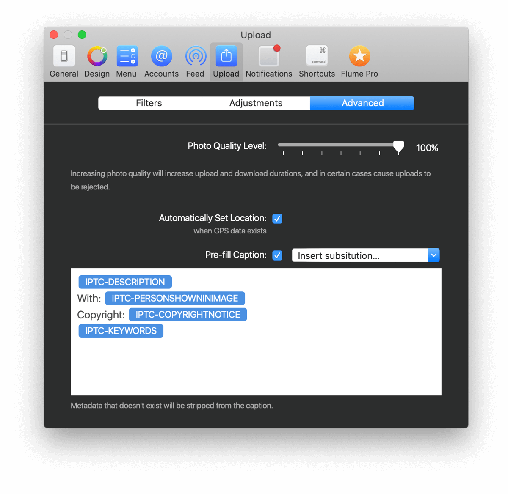

# Settings

### Photo Quality Level

Depending on the type of content you post to Instagram, you can speed up upload and download times by adjusting the image compression levels that are applied to your photos prior to upload.

For high resolution and high DPI photography, we recommend an 80% quality level which will result in minimal loss of image quality, while resulting in faster uploads and downloads.

If you mostly post lower resolution, and 72-DPI photos, we recommend a quality level between 80-100%.

## IPTC

The [IPTC Photo Metadata Standard](https://iptc.org/standards/photo-metadata/iptc-standard/) is the most widely used standard to describe photos. When adding metadata information with Photos.app, Adobe Lightroom, Capture One Pro and other popular photo-editing/cataloging software, this metadata is embedded into the photos and can be used by Flume to pre-fill information when uploading items.

### Pre-fill "Description" as Caption

If a `Description` tag is found in the photo's IPTC metadata, Flume will pre-fill the caption text of a new upload with this value.

### Pre-fill "Keywords" as Hashtags

If a `Keywords` tag is found in the photo's IPTC metadata, Flume will append the keywords at the end of the caption and prepend a \# character to turn the keywords into hashtags.

### Pre-fill "PersonInImage" as Mentions

If a `PersonInImage` tag is found in the photo's IPTC metadata, Flume will append the name at the end of the caption and prepend a `@` character to turn the text into an Instagram mention. Tagging the user in the photo automatically is not possible, as that requires prior knowledge of the Instagram username, and the desired tagging location in the photo. 

