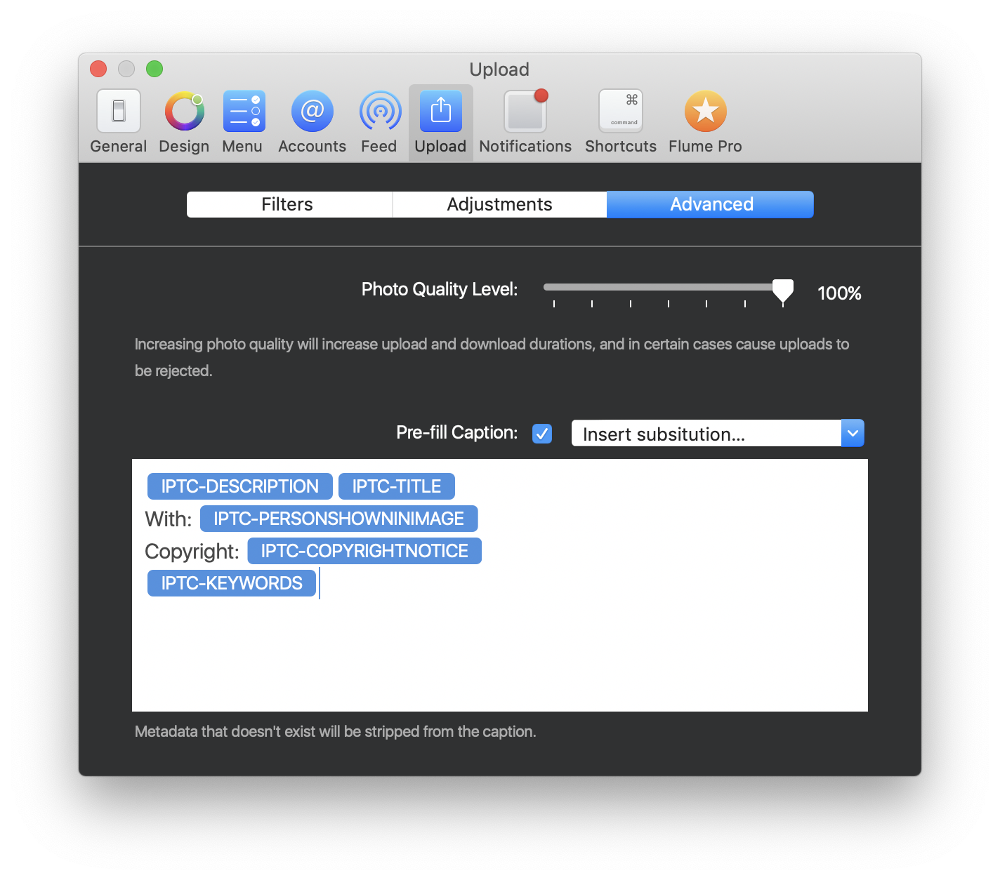

# Advanced

## Photo Quality Level

Depending on the type of content you post to Instagram, you can speed up upload and download times by adjusting the image compression levels that are applied to your photos prior to upload.

For high resolution and high DPI photography, we recommend an 80% quality level which will result in minimal loss of image quality, while resulting in faster uploads and downloads.

If you mostly post lower resolution, and 72-DPI photos, we recommend a quality level between 80-100%.

## Pre-fill Caption

Flume allows you to create your own customised caption, that can be populated using EXIF or IPTC information embedded in your photos and videos, or any text you wish \(eg. lists of hashtags\). 


The [IPTC Photo Metadata Standard](https://iptc.org/standards/photo-metadata/iptc-standard/) is the most widely used standard to describe photos. When adding metadata information with Photos.app, Adobe Lightroom, Capture One Pro and other popular photo-editing/cataloging software.


### 

