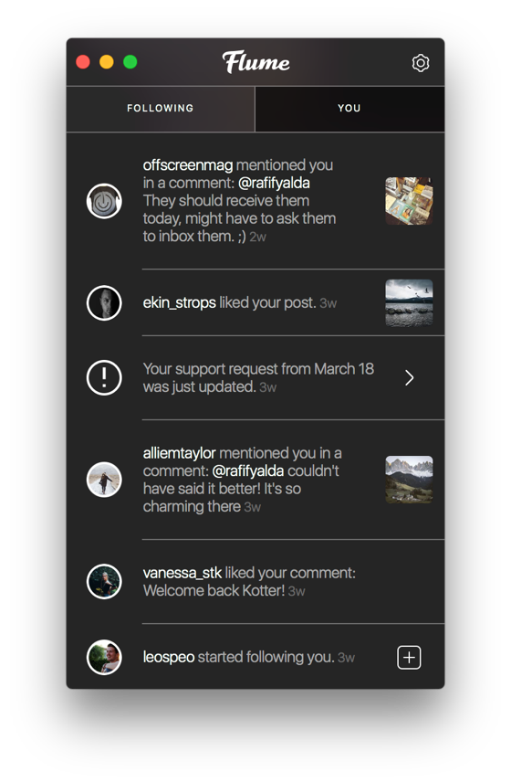
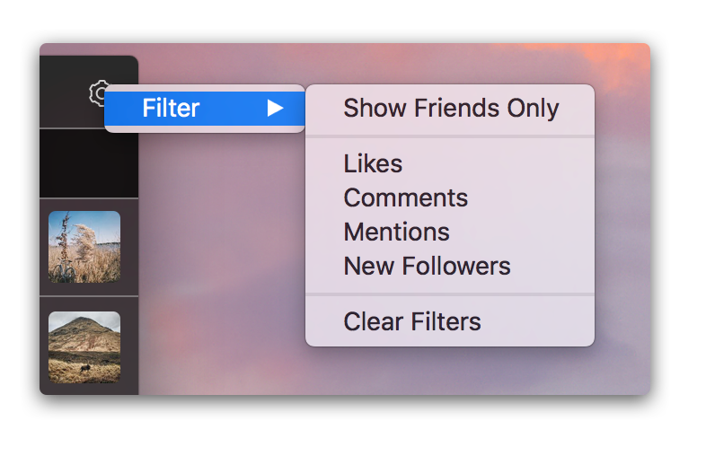
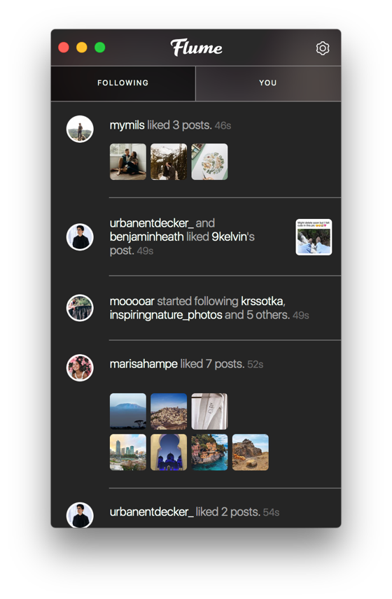

# Activity

The Activity tab shows you the latest notifications for your account. You can receive [desktop notifications](../preferences/notifications.md) when new activity arrives, as the Activity feed is automatically refreshed based on your [automatic refresh](../preferences/feed/#automatically-refresh) setting.

## You

The `You` tab lists the latest notifications that relate to the current account. These include:

* Likes on your posts
* New followers \(if not set to a [Private Profile](profile/settings/privateprofiles.md)\)
* Comments on your posts
* Mentions in a comment \(on your posts or others\)
* Likes on your comments \(on your posts or others\)
* Updated support requests
* Copyright removal notices
* New friends \(from your [Address Book](profile/settings/invitecontacts.md) or [Facebook](profile/settings/followfacebook.md)\) that join Instagram

Additionally, the following may display:

* A link to view the performance of your [Promotions](profile/businessprofiles/promote.md) \(if an Instagram Business Profile\)
* A link to view open follower requests \(if set to a [Private Profile](profile/settings/privateprofiles.md)\).

### Responding to Comments

An additional feature exists when new comments are received on your posts, with quick actions to reply, report or delete comments, directly from the Activity view.

To perform an action \(such as reply\) on a comment notification:

* Move the mouse to the right area of a comment notification to reveal the comment actions panel, and choose the appropriate action.

### Filtering Activity

By default, all notification types are displayed. To apply filters to the notifications, use the `Filter` option under the  button in the [title bar.](../misc/glossary.md#title-bar)

### Hiding Activity

To hide a specific activity notification:

* Right-click on an activity notification and select `Hide Activity` from the [contextual menu.](../misc/glossary.md#contextual-menu)
* When selecting a activity notification using the [keyboard arrows](../misc/keyboard-shortcuts.md), use the `Activity > Hide Activity` [Menu Bar](../misc/glossary.md#menu-bar) item.

## Following

The `Following` tab lists the latest notifications that relate to activity made by users you follow. These include:

* When users you follow like other posts
* When users you follow start following other users

