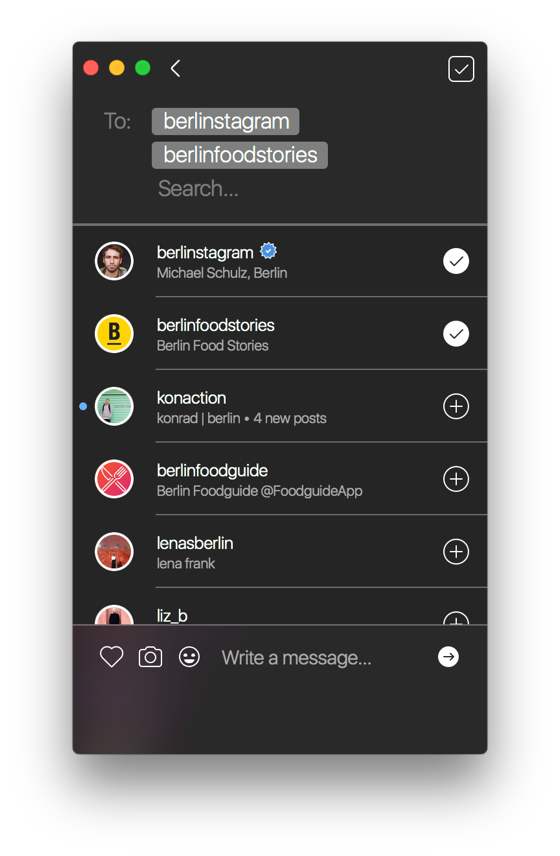

# List

The Conversations List view lists all your current conversations, allows you to create a new one-on-one or group conversation, as well as allowing you to block or allow pending message requests from profiles you do not follow.

## Creating Conversations

There are many ways to begin a conversation with a user, however you should note that if the recipient of a message does not follow you, your message will not appear in their inbox directly but as a [message request](list.md#message-requests) that they must approve or decline.

To create a new conversation from the conversations list:

* Click the compose  button in the title bar. 
* Tap the `New`  button in the [Touch Bar.](../../misc/touchbar.md)

A list of suggested recipients will appear, and you can search for specific profiles. Selecting more than one recipient will create a group conversation \([maximum of 15 recipients](../../misc/limits.md)\).

After making a selection, the confirm button and compose area will appear, allowing you to write your message or [share a photo/video.](messages.md#sharing-photos-videos)

 

You can also create conversations directly from the [Profile](../profile/) of a user.

To create a new conversation from the Profile of a user:

* Use the `Send Message` option under the  button in the title bar.
* Tap the `Message`  button in the [Touch Bar.](../../misc/touchbar.md)

## Deleting Conversations

Deleting a conversation will only remove the conversation from your own inbox, but will not remove it from the inbox of other recipients.

To delete a conversation:

* Right-click a conversation, then select `Delete Conversation…` from the contextual menu.
* When selecting a conversation using the [keyboard arrows](../../misc/keyboard-shortcuts.md), use the `Conversation > Delete Conversation…` [Menu Bar](../../misc/glossary.md#menu-bar) item.
* When viewing the conversation's [messages](messages.md), use the `Delete Conversation…` option under the  button.
* Tap the `Delete`  button in the [Touch Bar.](../../misc/touchbar.md)

You will be asked to confirm the deletion.

## Leaving Group Conversations

Leaving a group conversation will stop you from receiving any further messages in the group, though it will not remove your previous messages sent in the group. The other members of the group conversation will be made aware that you left the group conversation. You can be added back to a group if you have not [blocked the users](../profile/settings/blockedusers.md) in the group.

If you would prefer to remain in the group, but disable notifications of new messages, you can [mute the conversation](list.md#muting-conversations) instead.

To leave a group conversation:

* Right-click a conversation, then select Leave Conversation… from the contextual menu.
* When selecting a conversation using the [keyboard arrows](../../misc/keyboard-shortcuts.md), use the Conversation &gt; Leave Conversation… Menu Bar item.
* When viewing the conversation's [messages](messages.md), use the Leave Conversation… option under the  button.
* When viewing the conversation's [info](info.md), click the Leave  button in the title bar.
* Tap the Leave  button in the [Touch Bar.](../../misc/touchbar.md)

You will be asked to confirm leaving the group.

## Muting Conversations

Muted conversations will not send [desktop notifications](../../preferences/notifications.md) when new messages are received, and also disable push notifications to your mobile devices if enabled.

To mute/un-mute a conversation:

* Right-click a conversation, then select Mute/Unmute Conversation from the contextual menu.
* When selecting a conversation using the [keyboard arrows](../../misc/keyboard-shortcuts.md), use the Conversation &gt; Mute/Unmute Conversation Menu Bar item.
* When viewing the conversation's [messages](messages.md), use the Mute/Unmute Conversation option under the  button in the title bar.
* Tap the Mute  or Unmute  button in the [Touch Bar.](../../misc/touchbar.md)

Muted conversations will display a small icon to indicate their current mute status.

## Exporting Conversations

To export a conversation:

* Right-click a conversation, then select Export Conversation… from the contextual menu.
* When selecting a conversation using the [keyboard arrows](../../misc/keyboard-shortcuts.md), use the Conversation &gt; Export Conversation… Menu Bar item.
* When viewing the conversation's [messages](messages.md), use the Export… option under the  button in the title bar.

> **\[info\]** Exporting a conversation will only export the messages that Flume has downloaded locally. To ensure all messages in a conversation are exported, click to view the specific conversation and scroll up until all messages are displayed in Flume.

## Reporting / Blocking Conversations

To report a conversation:

* Right-click a conversation, then select Report… from the contextual menu.
* When selecting a conversation using the [keyboard arrows](../../misc/keyboard-shortcuts.md), use the Conversation &gt; Report… Menu Bar item.
* When viewing the conversation's [messages](messages.md), use the Report… option under the  button in the title bar.

You will be asked to confirm reporting the conversation \(user\).

> **\[info\]** Group conversations cannot be reported / blocked. You can report / block users in a group conversation by visiting their [profile](../profile/) from the [Conversation Info](info.md) view and using the regular block / report user feature.

## Message Requests

When a user that you do not follow sends you a message, their message will not appear immediately in your inbox, but requires approval. When you have open message requests, an indicator will appear above the list of conversations.

### Responding to Message Requests

You have the option of accepting or declining all message requests, or individually.

To accept / decline all message requests:

* Click either the accept  or decline  icon in the title bar when viewing the list of message requests. You will be asked to confirm your intention.

To accept / decline an individual message requests:

* Click on a conversation from the list of message requests, then click either the accept  or decline  icon in the title bar when viewing the list of message requests. You will be asked to confirm your intention.

## Filtering Conversations

To apply filters to your conversation threads, use the Filter option under the  button in the title bar.

## Searching Conversations

If you have lots of conversations, you can quickly filter by author or group chat name using the search field \(or use the ⌘F [keyboard shortcut](../../misc/keyboard-shortcuts.md)\) It is not currently possible to perform a full-text search of messages within each conversation, due to limitations in the Instagram API.

## Adding / Removing Conversation Bookmarks

Bookmarked conversations appear at the top of all others in the conversations list, and provide you with quick access to conversations regardless of the conversation's age.

To toggle a conversation as a Bookmark, perform one of the following:

* Click the Bookmarks icon  in the title bar when viewing the [messages](messages.md) of a conversation.
* Use the View &gt; Add/Remove "Conversation Name" to Bookmarks Menu Bar item.

