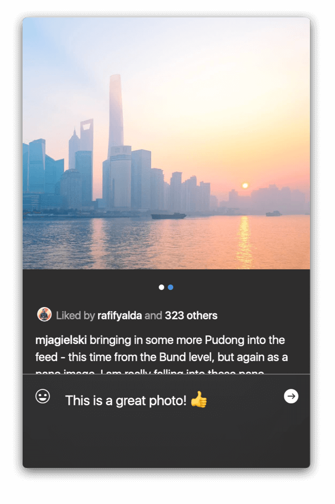

# Details

The Details View allows you view all information related to a post, including its caption, comments, likes, tagged location, tagged users and more.

## Carousel Posts

[Carousel posts](https://help.instagram.com/269314186824048) are multiple photos and videos \(up to 10\) combined into a single post.

 

There are multiple methods to view a carousel post:

* Hover over the carousel post, and use the left and right cursors that appear.
* Click-and-swipe left or right with the mouse / trackpad.


Each photo in a carousel post can contain different tagged users. See [Tagged Users](detailview.md#tagged-users) for more. Videos cannot contain any tagged users.


## Comments

The comments on a post are displayed by default below the caption \(if present\).


If [comments are disabled](detailview.md#enabling--disabling-comments) on a post, you will not be able to view any previous comments, or add any new comments. If comments are [restricted](detailview.md#restricting-comments) and you do not fit the permitted commenters, you will only be able to view comments and not add or reply to existing comments.


### Writing Comments

To write a new comment:

* Click the comment  button in the [title bar.](../misc/glossary.md#title-bar)
* Tap the comment  button in the [Touch Bar.](../misc/touchbar.md)
* Use the `Post > Comment on [Photo | Video]…` [Menu Bar](../misc/glossary.md#menu-bar) item.

The comment compose area will appear ready for you to write a comment. To send your comment, press `↩ ENTER/RETURN` or click the send  button.


When writing the first comment for one of your own posts, it will be converted automatically into the caption of the post.


### Replying to Comments

To reply to a comment:

* Move the mouse to the left area of a comment to reveal the comment actions panel, then click the reply  button.  
* Right-click a comment, then select `Reply to @username` from the [contextual menu.](../misc/glossary.md#contextual-menu)
* When selecting a comment using the [keyboard arrows](../misc/keyboard-shortcuts.md), use the `Comment > Reply to @username` [Menu Bar](../misc/glossary.md#menu-bar) item.
* When selecting a comment using the [keyboard arrows](../misc/keyboard-shortcuts.md), tap the reply  button in the [Touch Bar.](../misc/touchbar.md)


When replying to a comment, replies are indented in order to support comment threading. If manually typing the username to reply to, the comment will not be considered a reply to a specific comment. It is recommended you always use the methods listed above to reply to a specific comment.


### Liking Comments

To like / unlike a comment:

* Move the mouse to the left area of a comment to reveal the comment actions panel, then click the like  button.  
* When selecting a comment using the [keyboard arrows](../misc/keyboard-shortcuts.md), use the `Comment > Like/Unlike Comment` [Menu Bar](../misc/glossary.md#menu-bar) item.
* When selecting a comment using the [keyboard arrows](../misc/keyboard-shortcuts.md), tap the like  button in the [Touch Bar.](../misc/touchbar.md)

### Viewing Comment Likes

To view the likes on a specific comment:

* Click the `X likes` button that appears when a comment has at least 1 like.

### Bulk Deleting Comments

On your own posts, you can quickly delete multiple comments at once rather than one at a time.

To bulk delete comments:

1. When viewing one of your own posts, select the `Delete Comments…` item under the actions  button in the [title bar.](../misc/glossary.md#title-bar)
2. Select the comments you wish to delete.
3. Confirm your selection by clicking the confirm  button in the [title bar](../misc/glossary.md#title-bar) or in the [Touch Bar.](../misc/touchbar.md)

You can also [disable commenting](detailview.md#enabling--disabling-comments) on your post, which will hide all previous comments automatically.

### Deleting Comments

To delete a single comment:

* Move the mouse to the left area of a comment to reveal the comment actions panel, then click the delete  button.  
* Right-click a comment, then select `Delete Comment…` from the [contextual menu.](../misc/glossary.md#contextual-menu)
* When selecting a comment using the [keyboard arrows](../misc/keyboard-shortcuts.md), use the `Comment > Delete Comment…` [Menu Bar](../misc/glossary.md#menu-bar) item.


You can also delete your own comments you make on others posts.


### Reporting Comments

To report a comment:

* Move the mouse to the left area of a comment to reveal the comment actions panel, then click the report  button.  
* Right-click a comment, then select `Report…` from the [contextual menu.](../misc/glossary.md#contextual-menu)
* When selecting a comment using the [keyboard arrows](../misc/keyboard-shortcuts.md), use the `Comment > Report…` [Menu Bar](../misc/glossary.md#menu-bar) item.

### Translating Comments

To translate a comment:

* Right-click a comment, then select `Translate…` from the [contextual menu.](../misc/glossary.md#contextual-menu)
* When selecting a comment using the [keyboard arrows](../misc/keyboard-shortcuts.md), use the `Comment > Translate…` [Menu Bar](../misc/glossary.md#menu-bar) item.
* When selecting a comment using the [keyboard arrows](../misc/keyboard-shortcuts.md), tap the Translate  button in the [Touch Bar.](../misc/touchbar.md)


The translation will use your current [language](../preferences/general.md#language) setting.


### Enabling / Disabling Comments

By defaults, comments are permitted on your posts. You can disable commenting on your posts if you prefer.

To enable/disable comments on your posts:

* When viewing one of your own posts, select the `Turn Commenting On/Off` item under the actions  button in the [title bar.](../misc/glossary.md#title-bar)

## Likes

To view the latest likes on a post:

* Click the `X likes` button beneath the post. This only appears if the post has at least 1 like, and in some instances, may include references to some profiles that you follow.


A maximum of the latest 999 likers are displayed.


## Tagged Users

If a photo contains tagged users, the tagged users  button will appear above the post and automatically fades out.

 

To view the tagged users in a post \(or [carousel post](detailview.md#carousel-posts)\):

1. Hover over the photo.
2. Click the tagged users  button which appears.
3. Select a tagged user to view their [Profile.](profile/)


Only photos can contain tagged users.


## Tagged Locations

If a post is tagged at a location, its name will appear above the caption \(if present\). Clicking the location name will display the [Location view.](locations.md)

## Muting Videos

To mute / unmute a video:

* Click the  or   button which appears in the bottom-left corner when hovering the mouse cursor over the post content.


Your mute/unmute preference is saved for all video posts in the future. If a video does not contain any audio, `Video has no sound`will be displayed instead of a button.


## Translating Captions

To translate a caption:

* Right-click the caption, then select `Translate…` from the [contextual menu.](../misc/glossary.md#contextual-menu)


The translation will use your current [language](../preferences/general.md#language) setting.


## Browsing Feeds

When viewing the Details View from the [Feed](feed.md), [Likes](likes.md) or [Explore](explore.md) views, additional options are available to quickly browse through the content without needing to move back-and-forth between the Details View and the previous list of media.

* Click the previous  or next  button in the [title bar.](../misc/glossary.md#title-bar)
* Use the `⌘{` or `⌘}` [keyboard shortcuts.](../misc/keyboard-shortcuts.md)

