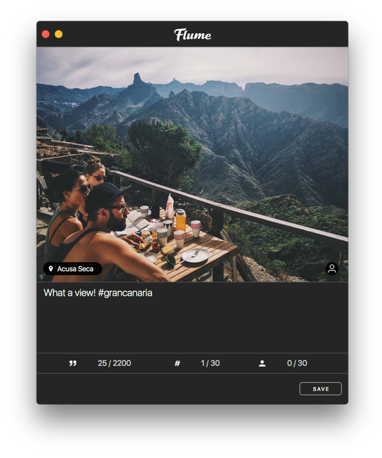

# Editing

The Editing window allows you edit information about a previous post. The user tags \(photos-only\), location and caption can be edited at any time. If you're looking to [make edits to a photo or video](upload.md#editing), you'll need to do that when uploading.

## Editing Posts

To edit a post:

* Right-click any of your posts, then select `Edit Photo/Video…` from the [contextual menu.](../misc/glossary.md#contextual-menu)
* When viewing the [Details](detailview.md) of your own posts, select the `Edit Photo/Video…` item under the actions  button in the [title bar.](../misc/glossary.md#title-bar)

### Captions

The caption of a post can be edited at any time. When typing a `#` or `@` character, your keyboard input will also search Instagram for matching hashtags and users until you select an item from the popover, press the `⎋ (ESC)` key, or press another space.


[Limits apply](../misc/limits.md) to the length of the caption, the number of hashtags, and mentions.


### Tagged Users

You can include up to 30 users to tag in a photo. The tagged users can be viewed in the [Details View](detailview.md#tagged-users).

 


Only photos can contain tagged users.


#### Editing Tagged Users

To edit the tagged users in a photo:

1. Click the tagged users  button on the photo, or tap the button in the [Touch Bar.](../misc/touchbar.md)
2. Click a position in the photo where the user is located.
3. Type in the search text field to find the relevant user.
4. Click on a search result to confirm the user tag.

#### Removing Tagged Users

To remove a tagged user:

1. Click the tagged users  button on the photo, or tap the button in the [Touch Bar.](../misc/touchbar.md)
2. Hover the mouse over the user tag you wish to remove and click it once.

#### Repositioning Tagged Users

To reposition a tagged user:

1. Click the tagged users  button on the photo, or tap the button in the [Touch Bar.](../misc/touchbar.md)
2. Hover the mouse over the user tag you wish to remove and click-and-drag it to a new position.

### Tagged Locations

#### Adding Tagged Locations

To add a location on a photo or video:

1. Click the `Add Location` button, or tap the location  button in the [Touch Bar.](../misc/touchbar.md)
2. Type to search for the location to tag, or click the Nearby Places  button to search locations close to your current position.
3. Select a location from the search results. If no search results could be found, the results popover will disappear.


If the photo or video contains [geotag](https://en.wikipedia.org/wiki/Geotagging) location information, Flume will automatically search for the GPS coordinates where the photo or video was taken. You cannot tag exact GPS coordinates on Instagram, and all tagged locations must exist as Facebook Places. To add new locations, see [Instagram's Help Center.](https://help.instagram.com/1618893218361276)


#### Editing Tagged Locations

To edit a location on a photo or video:

* Click the name of the location, and select the `Edit Location` item.
* Tap the edit location  button in the [Touch Bar.](../misc/touchbar.md)

#### Removing Tagged Locations

To remove an existing location on a photo or video:

* Click the name of the location, and select the `Remove Location` item.
* Tap the edit location  button in the [Touch Bar.](../misc/touchbar.md)

