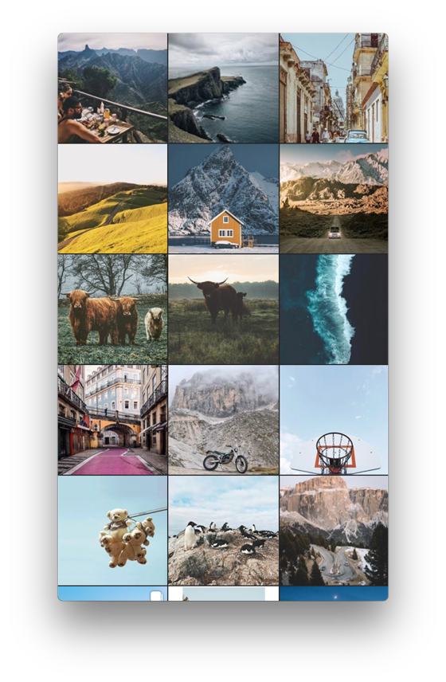
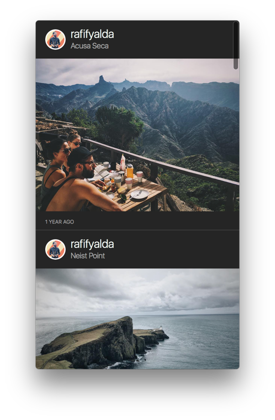
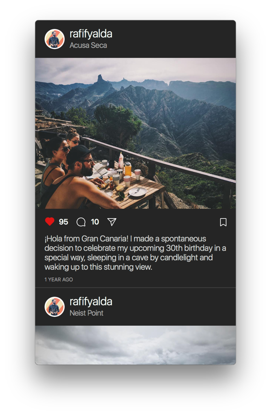

# Feed

The Feed tab is your "Home", and displays your timeline. Depending on your [Design Preferences](../preferences/design.md), the layout can differ in multiple ways.

Your Feed is [limited](../misc/limits.md) to the last 200 items. You can use [Search](search.md) or the [Go to User…](../misc/keyboard-shortcuts.md) shortcut to quickly jump to a specific [Profile](profile/) and view older posts.

## View Modes

The Feed, as well as your [Likes](likes.md) and [Profiles](profile/) can be viewed in either Column-View or Grid-View mode.

 

### Switching View Modes

To adjust your viewing mode preference, you can use:

* The View-Mode Switcher in the title bar. If the title bar is not visible, hover near the top of the main Flume window and it will appear. You can adjust your [Design Preferences](../preferences/design.md#always-show-the-title-bar) to have the title bar appear at all times.
* The [Menu Bar](../misc/glossary.md#menu-bar) under `View > Column/Grid` View.
* The [keyboard shortcuts](../misc/keyboard-shortcuts.md) `⌥⌘1` or `⌥⌘2`.
* The View-Mode Switcher in the [Touch Bar.](../misc/touchbar.md)

### Column-View Media Details

By default, Flume displays your Feed and Likes in an edge-to-edge format, removing distracting information and leaves you to enjoy the photos and videos as individual works of art. If you would rather view more metadata, Column-View offers 4 different levels, as explained in [Design Preferences](../preferences/design.md#show-media-details).

   

## Feed Ordering

Posts are ordered based on factors like how recently the post was shared, your interactions with the person who shared it and whether you'll find the post interesting. Posts you're likely to care about most will appear higher in your feed. For more information, please visit [How Feed Works.](https://help.instagram.com/1400877086604710)

