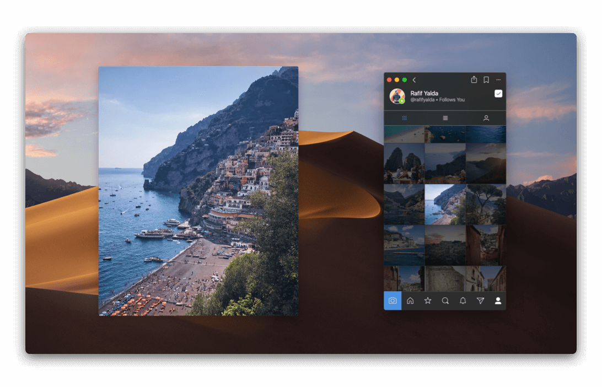

# Large Preview

The Large Preview window allows you to zoom in on posts quickly and at their original size.


If the photo or video is too large to fit on your display, it is scaled to fit appropriately.

The large preview window can be moved to any screen and position, and is saved for future use.


## Viewing Large Previews

To view a large preview:

* Long-press on any post, [shared photo or video](conversations/messages.md), or [activity](activity.md) preview.
* Use the `Post > Large Preview` [Menu Bar](../misc/glossary.md#menu-bar) item when selecting a post via the [keyboard arrows](../misc/keyboard-shortcuts.md) or viewing the [details](detailview.md) of a post.
* When hovering your mouse cursor over a post, use the `Spacebar` [Hover Shortcut.](../misc/hover-shortcuts.md)

