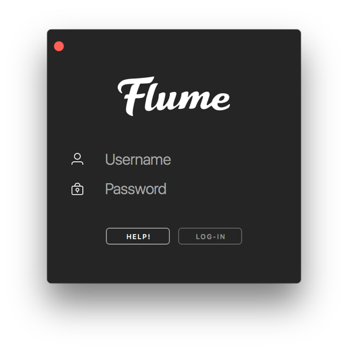
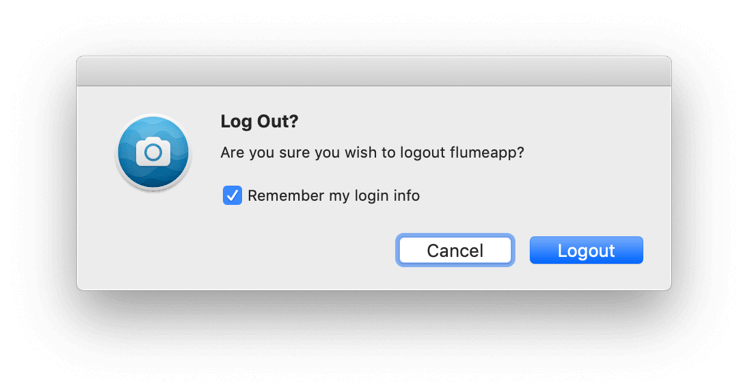
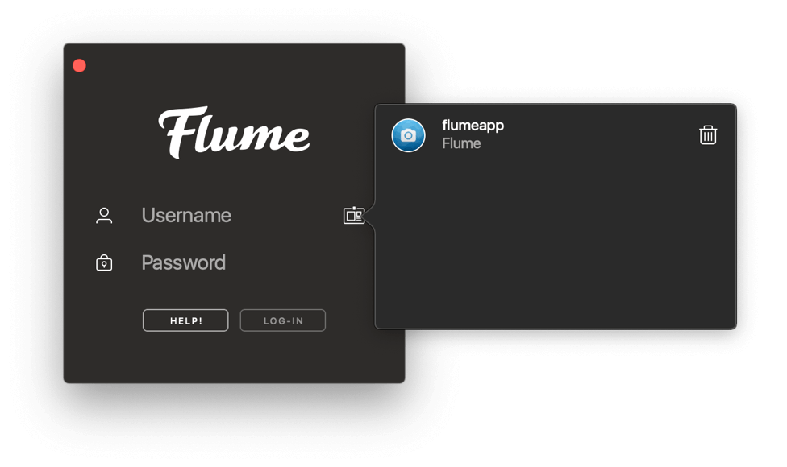

# Login

Upon launching Flume, you will be presented with the Login Window. This window will also appear as a sheet when you are adding [multiple accounts.](../preferences/accounts.md)

 

Click `Let's Go!` to get started and enter your Instagram username and password to login.

If you have [1Password](https://1password.com) installed on your Mac, the 1Password logo will appear next to the Password field allowing you quicker access to copy and paste your password securely.


Do not enter your Flume Pro licence code as your password. You activate Flume Pro from your licence code email, or manually in [Flume Pro preferences.](../preferences/flumepro.md)



As of [Flume 2.7](../general/whatsnew.md), you can also login with your email address or phone number \(if applicable\).


## One-Click Login

 

When logging out of an account, you have the option for Flume to remember your login information.

When enabling this option, a saved accounts  button appears allowing you to log quickly back into previously saved accounts with just one click.

## Two-Factor Authentication

If you have enabled [Two-Factor Authentication \(2FA\)](profile/settings/twofactor.md) on your account, you will be asked to enter a code sent to your linked phone number after logging in.


Flume only supports SMS-based 2FA currently. Third-party 2FA authenticator apps are not supported at this stage.


## Login Errors

If login fails, a visible error alert will appear describing the issue. If your account has been disabled for violating Instagram's Community Guidelines, please consult [Instagram Support](https://help.instagram.com/366993040048856) for more info.

## Facebook Login

If you normally use Facebook to login to Instagram, click on the `Help!` button and select the `I want to log-in with my Facebook account` option.

## Forgotten Password

To reset your password:

* Click on the `Help!` button and select the `I forgot my password, or don't have one` option.
* Visit [Instagram's password reset form](https://www.instagram.com/accounts/password/reset/) directly.

## Registering an Instagram account

Flume does not currently support registration of Instagram accounts.

To register a new Instagram account:

* Click on the `Help!` button and select the `I don't have an Instagram account` option.
* Visit [Instagram's website](https://instagram.com) directly.

