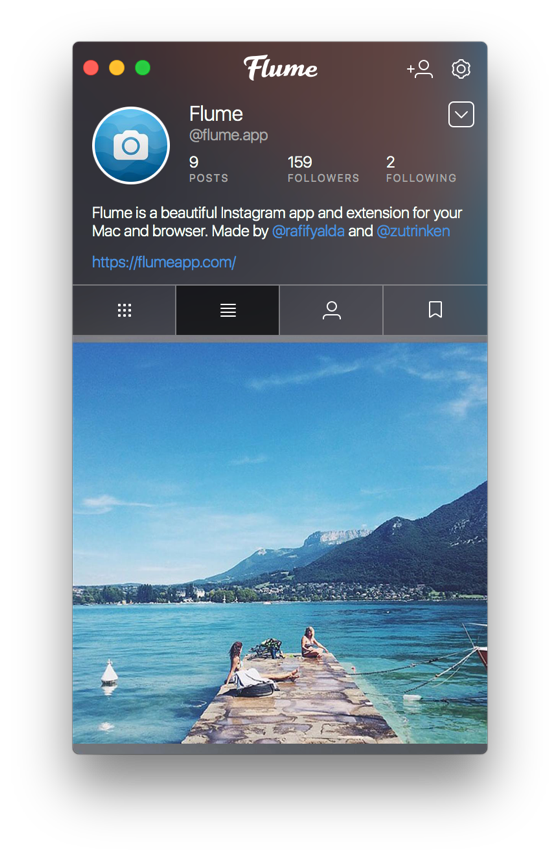
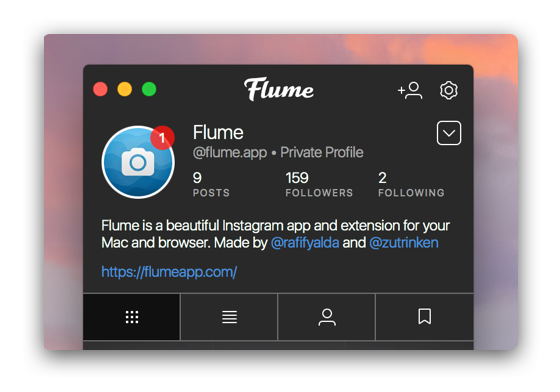
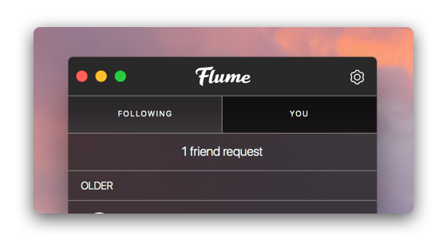
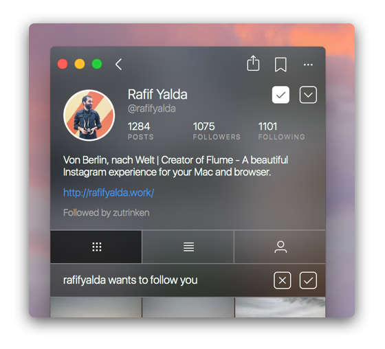
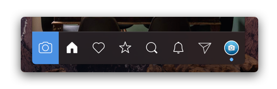
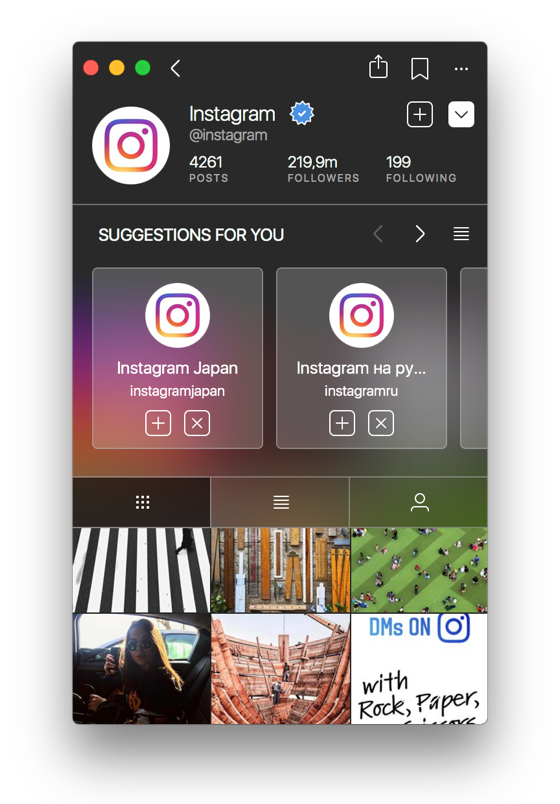
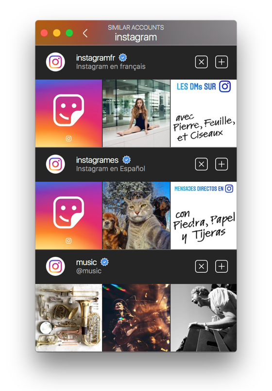

# Profile

The Profile view displays all the posts and related information for a particular user. Certain features will toggle if you are viewing your own profile, a [Business Profile](businessprofiles/), a [private user](privateprofiles.md).

 

## Posts

Posts can be viewed in either Grid-View \(default\), or Column-View.

* To view posts in Grid-View, click the Grid-View  button in the profile tab bar.
* To view posts in Column-View, click the Column-View  button in the profile tab bar.

## Tagged Posts

To view posts that the profile's user has been tagged in:

* Click the Tagged  button in the profile tab bar.

When viewing the tagged posts on your own profile, you can also remove tags from posts.

### Removing Tagged Posts

To remove yourself from posts you have been tagged in:

* Use the Hide Photos… option under the actions  button that appears above the tagged posts on your profile. Make your selections, and confirm them by clicking the confirm  button in the title bar. You can cancel the selections using the  cancel button.
* When viewing the [details](../detailview.md) of a post you are tagged in, use the Remove me from Photo/Video… option under the actions  button in the title bar.
* When viewing the [details](../detailview.md) of a post you are tagged in, use the Remove me from Photo/Video… option in the Menu Bar.

### Changing Tagging Options

If you would like to disable users from being able to tag you in photos:

* Use the Tagging Options… option under the actions  button that appears above the tagged posts on your profile.

If set to "Add Manually", you will be notified in [Activity](../activity.md) when someone tags you in a photo, with the option to accept or remove the tag.

## Saved Posts

When viewing your own profile, an extra tab will appear, that allows you to view all the posts you have [saved](https://help.instagram.com/1744643532522513) as well as your [Saved Collections.](savedcollections.md) Only you can see this tab, and the posts you have saved.

To view posts that you have saved:

* Click the Saved  button in the title bar.
* When viewing your [Profile](./), select the Saved… item under the [Settings](settings/)  button in the title bar.

## Archived Posts

When viewing your own profile, you can view all the posts you have archived. Only you can see these posts.

To view posts that you have archived:

* Click the Archived  button in the profile title bar.

To archive or unarchive a post:

* Right click a post and choose the Archive Photo/Video or Show on Profile menu item.
* When viewing the [details](../detailview.md) of one of your posts, use the Archive Photo/Video or Show on Profile option in the Menu Bar.

## Followers / Following

To view the followers or followings of a profile, click the "Followers" or "Following" button. The current relationship status between you and each user is displayed, allowing you to quickly follow or unfollow users from other profiles.

To follow/unfollow a user:

* Click the Follow  or Following  button \(when hovering, the Following button will change in appearance to the Unfollow  button\).

## Friend Requests

If your profile is set to [private](privateprofiles.md), users that wish to follow you will require your approval. When there are pending friend requests, they will be visible in various places:

* On your profile, with a badge that appears above your avatar.  
* At the top of your [activity.](../activity.md)  
* On the profile of user that sent the friend request, a banner will appear.  
* The Profile tab in the Flume menu will show an indicator.  
* The Dock icon will be badged \(see [Notifications Preferences](../../preferences/notifications.md)\)

### Responding to Friend Requests

To respond to friend requests:

* When viewing the list of pending friend requests, click the Accept  or Decline  button that appears next to each user.
* When viewing the profile of user that has sent you a friend request, click the Accept  or Decline  button that appears below the user's biography.


If you [switch your profile to a public profile](privateprofiles.md), all pending friend requests will be accepted.


## Similar Account Suggestions

To view similar account suggestions on a profile:

* Click the collapse  button. To scroll the suggestions, use the  and  buttons, or view all similar account suggestions by clicking the  button.

 

### Following Account Suggestions

To follow a suggestion:

* Click the  button next to each user.

### Ignoring Account Suggestions

To dismiss a suggestion:

* Click the  button next to each user.


You can opt-out of being suggested for other users by editing your profile via the Instagram website. [Learn more.](https://help.instagram.com/530450580417848)


## Profile Previews

Profile previews are a way to quickly inspect a user's profile and follow them without leaving your current view. These are similar to the long-press actions or 3D Touch behaviours found on the mobile Instagram apps.

To view a profile preview:

* Long-press on any profile picture or username

To follow a user in a profile preview, click the Follow  button.

To close a profile preview, press the ⎋ \(ESC\) key, or click outside of the preview.

