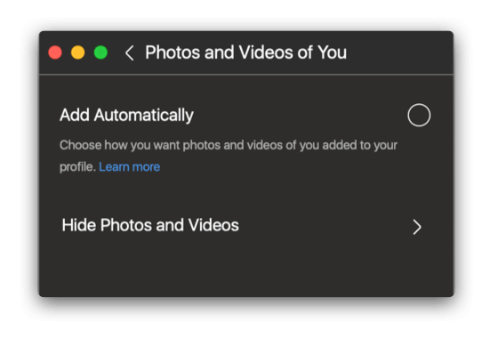

# Profile

The profile view displays all the posts and related information for a particular user. Certain features will toggle if you are viewing your own profile, a [business profile](businessprofiles/), a [private user](settings/privateprofiles.md).

## Posts

Posts can be viewed in either a [single column or a 3x3 grid.](../feed.md#view-modes)

* To view posts in a 3x3 grid, click the grid  button in the profile tab bar.
* To view posts in single column, click the column  button in the profile tab bar.

## Tagged Posts

To view posts that the profile's user has been tagged in:

* Click the tagged  button in the profile tab bar.

When viewing the tagged posts on your own profile, you can also remove tags from posts.

### Removing Tagged Posts

To remove yourself from posts you have been tagged in:

* Use the `Hide Photos…` option under the actions  button that appears above the tagged posts on your profile. Make your selections, and confirm them by clicking the confirm  button in the [title bar.](../../misc/glossary.md#title-bar) You can cancel the selections using the  cancel button.
* When viewing the [details](../detailview.md) of a post you are tagged in, use the `Remove me from [Photo|Video]…` option under the actions  button in the [title bar.](../../misc/glossary.md#title-bar)
* When viewing the [details](../detailview.md) of a post you are tagged in, use the `Remove me from [Photo/Video]…` option in the [menu bar.](../../misc/glossary.md#menu-bar)

### Changing Tagging Options

If you would like to disable users from being able to tag you in photos:

* Use the `Tagging Options…` option under the actions  button that appears above the tagged posts on your profile.

If set `Add Automatically`  is disabled, you will be notified in [activity](../activity.md) when someone tags you in a photo, with the option to keep or remove the tag.

## Saved Posts

To view posts that you have saved:

* Click the `Saved…` menu item in [profile settings.](settings/)

## Archived Posts

When viewing your own [profile](./), you can view all the posts you have archived. Only you can see these posts.

To view posts that you have archived:

* Click the `Archived…` menu item in [profile settings.](settings/)

To archive or unarchive a post:

* Right click a post and choose the `Archive [Photo|Video]` or `Show on Profile` menu item.
* When viewing the [details](../detailview.md) of one of your posts, use the `Archive [Photo|Video]` or `Show on Profile option` in the [menu bar.](../../misc/glossary.md#menu-bar)

## Followers / Following

To view the followers or followings of a profile, click the `Followers` or `Following` button. The current relationship status between you and each user is displayed, allowing you to quickly follow or unfollow users from other profiles.

To follow/unfollow a user:

* Click the follow  or following  button \(when hovering, the following button will change in appearance to the unfollow  button\).

## Friend Requests

If your profile is set to [private](settings/privateprofiles.md), users that wish to follow you will require your approval. When there are pending friend requests, they will be visible in various places:

* On your profile, with a badge that appears above your avatar.
* At the top of your [activity.](../activity.md)
* On the profile of user that sent the friend request, a banner will appear.
* The profile view in the Flume menu will show an indicator.
* The [Dock](../../misc/glossary.md#dock) icon will be badged \(see [Notifications Preferences](../../preferences/notifications.md)\)

### Responding to Friend Requests

To respond to friend requests:

* When viewing the list of pending friend requests, click either the accept  or decline  button that appears next to each user.
* When viewing the profile of user that has sent you a friend request, click either the accept  or decline  button that appears below the user's biography.


If you [switch your profile to a public profile](settings/privateprofiles.md), all pending friend requests will be accepted.


## Similar Account Suggestions

To view similar account suggestions on a profile:

* Click the collapse  button. To scroll the suggestions, use the  and  buttons, or view all similar account suggestions by clicking the  button.

 

### Following Account Suggestions

To follow a suggestion:

* Click the  button next to each user.

### Ignoring Account Suggestions

To dismiss a suggestion:

* Click the  button next to each user.


You can opt-out of being suggested for other users by editing your profile via the Instagram website. [Learn more.](https://help.instagram.com/530450580417848)


## Profile Previews

Profile previews are a way to quickly inspect a user's profile and follow them without leaving your current view. These are similar to the long-press actions or 3D Touch behaviours found on the mobile Instagram apps.

To view a profile preview:

* Long-press on any profile picture or username

To follow a user in a profile preview, click the follow  button.

To close a profile preview, press the `⎋ (ESC)` key, or click outside of the preview.

