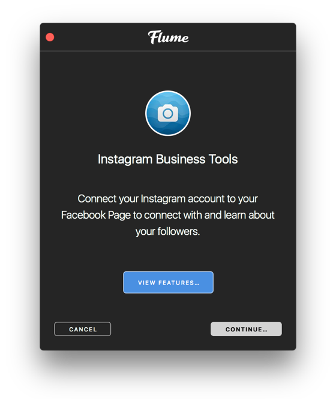

# Business Profiles

A business profile on Instagram will help your customers connect to your business. When converting to a business profile, you'll be able to include additional information about your business on your profile. For example, you'll be able to add a phone number, an email address and your business's physical address. Keep in mind that you must include at least 1 contact option.

When you add contact information, people will see contact options on your [profile](../) like `Get Directions`, `Call` and `Email`, depending on the contact information you provided.

Additionally, when you convert to a business profile, you'll get access to [Insights](insights.md) and [promoting posts.](promote.md)

You can find more information about business profiles at [Facebook's Business Help.](https://www.facebook.com/business/help/897631030335607/)

## Switch to a Business Profile

Only businesses on Instagram should use business profiles. Additionally, to get access, your business must have a [Facebook Page.](https://www.facebook.com/help/pages)


[Private profiles](../settings/privateprofiles.md) can't be used as business profiles.


To switch to a business profile:

1. When viewing your own [profile](../), select the `Switch to Business Profile…` item under the [settings](../settings/)  button in the [title bar.](../../../misc/glossary.md#title-bar)
2. On the `Log-in With Facebook` screen, you'll see all of the Facebook Pages you're currently an admin on. Select the Facebook Page you'd like to associate with your business profile on Instagram. [Learn more about Page roles.](https://www.facebook.com/help/323502271070625)
3. On the `Set Up Your Business Profile` page, review your business's contact information, make any changes and click `Done`.


Once you've linked a Facebook Page to your business profile, you'll only be able to [share](../../upload.md#sharing) your Instagram posts to Facebook through that Page. You won't be able to share to another Facebook Page or to a Facebook profile. If you'd like to switch the Facebook Page you're able to share Instagram posts to, you'll need to [switch back to a personal account.](./#switch-back-to-a-personal-account) Once you've switched back, you'll then need to set up your business profile again and select the new Facebook Page you'd like to use.


## Switch Back to a Personal Account

To switch a business profile back to a personal account:

* When viewing your own [profile](../), select the `Switch Back to Personal Account…` item under the [settings](../settings/)  button in the [title bar.](../../../misc/glossary.md#title-bar)


You can convert your business profile on Instagram back to a personal account at any time although you will lose access to business profile features such as [insights](insights.md) and the ability to [promote posts.](promote.md)


