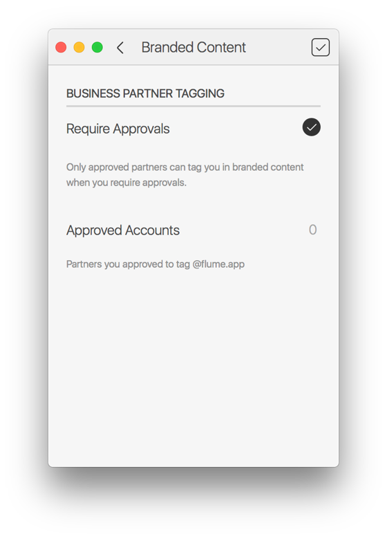

# Branded Content Approvals

## Business Profiles

### Branded Content Approvals

If you have an Instagram [Business Profile](./), you can control which accounts have the permission to tag you in their posts. This feature is a part of Instagram's [Branded Content Expansion.](https://business.instagram.com/a/brandedcontentexpansion)

#### Adjust Business Partner Tagging

To adjust your branded content tagging settings:

* When viewing your [Profile](../), select the Branded Content Approvals item under the [Settings](../settings/)  button in the title bar.

