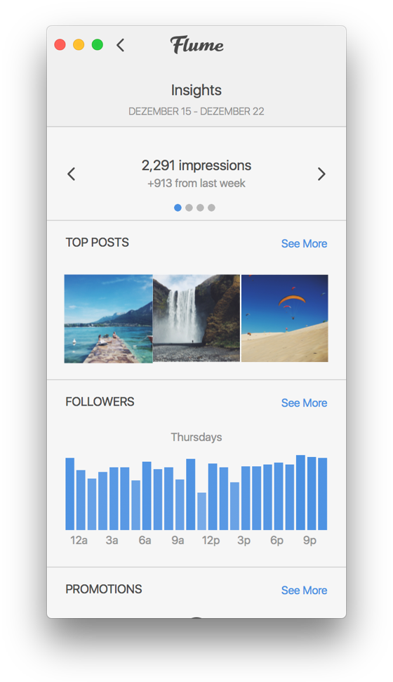
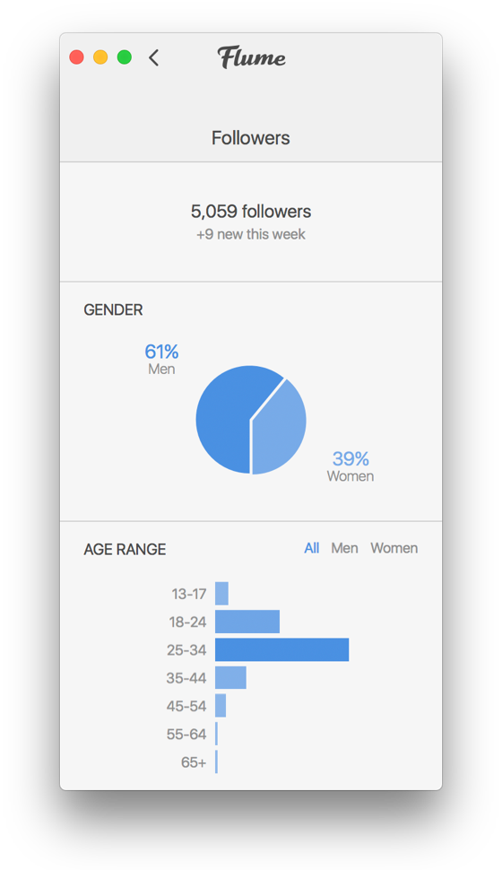

# Insights

The insights view provides information on who your followers are, when they're online and more. You can also view insights for specific posts and stories you've created to see how each performed and how people are engaging with them.

You can find more information about business insights at [Facebook's Business Resources.](https://www.facebook.com/business/help/897631030335607/)

 


Once you [convert your personal profile over to a business profile](./), you won't be able to view past insights from before you converted your account.


## Viewing Insights

To view your business insights:

* When viewing your own profile, click the `Insights` item under the [settings](../settings/)  button in the [title bar.](../../../misc/glossary.md#title-bar)  button in the [title bar.](../../../misc/glossary.md#title-bar)

## Exporting Insights

Flume allows you to export your Insights to a simple `.txt` format for use in other applications. To export your Insights:

* Click the download  button in the [title bar. ](../../../misc/glossary.md#title-bar)


The export feature will export the currently visible insights.


## Available Insights

### **Insights for Posts and Stories**

**Impressions:** Total number of times your post or story was seen

**Reach:** Number of unique accounts who saw your post or story

**Website Clicks:** Number of accounts that have tapped the website link on your Business Profile

**Follower Activity:** Average times your followers are on Instagram on a typical day

**Video Views:** Number of times your video was viewed for 3 or more seconds

**Saves:** The number of unique accounts that saved your post


If your post contains multiple photos or videos, your metrics will still be counted as if there's only one photo or video in your post.

For example, regardless of whether someone only views the first out of 10 photos in your post, the post will only receive one impression. Even posts with multiple photos and videos receive one impression for the entire post, when someone views them.


### **Insights Specific to Stories**

**Replies:** Number of times people send messages through the Send Message option on your story

**Exits:** The number of times someone swiped from one of your stories to someone else's story, or returned to their feed.


While you can view insights on past stories, you won't be able to view past stories that have expired. Stories last for 24 hours, before expiring.


### **Insights for Live Content**

Instagram doesn't offer insights for live content.

## Notes

* Keep in mind that impressions and reach are different. Impressions are the total number of times your post was seen. A single individual may see your post 5 times. Each time they see it, you'll get an impression. Reach is based on the number of unique people who view your post. Each unique individual will only be counted once, even if they view your post multiple times.
* You'll also see the following insights about your followers, including gender, age and location information.
* If you're viewing insights from a post, you'll be able to see Impressions, Reach and Engagement. Engagement includes the total number of unique Instagram accounts that liked, commented on or saved your post.
* You'll be able to see data on your posts and stories, regardless of the number of followers you have. However, Business Profiles on Instagram must have 100 or more followers in order to see demographic metrics like age and gender.
* Insights on your stories will only start being tracked after you opt into tracking insights for your stories. To start tracking insights for your stories, you will need to tap the "Get Started" button when viewing your Insights on the official mobile Instagram app.

