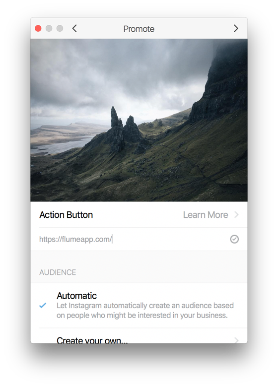
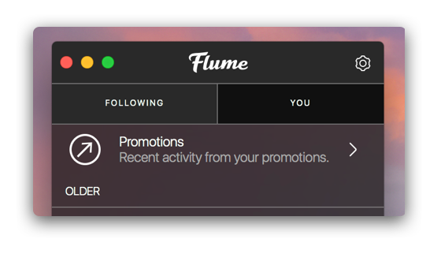

# Promotions

## Business Profiles

### Promotions

You can find more information about promoting posts at [Facebook's Business Resources.](https://www.facebook.com/business/help/897631030335607/)

#### Requirements

* You'll need to [switch to a Business Profile.](./). 
* You'll also need to be an [admin of the Facebook Page](https://www.facebook.com/business/help/218638451837962) associated with the Business Profile. 
* Promoted posts must also abide by [Facebook's advertising policies.](https://www.facebook.com/business/help/732496170188362)

#### Promoting a Post

To promote a post:

* Right-click any post of yours, then select `Promote…` from the contextual menu.

The Promote window will appear with your chosen post ready to configure.

Once you've confirmed your promotion, it will be reviewed to ensure it meets [Facebook's ad policies.](https://www.facebook.com/business/help/732496170188362) Promotions are generally reviewed in 60 minutes, but in some instances, the review process may take longer. Your promotion will begin running after it's been reviewed and approved.


It is not possible to promote [carousel posts](../../detailview.md#carousel-posts) currently.


#### Viewing Promotions

To view your current, existing, and expired promotions:

* Click the `Promotions` item that appears at the top of your [Activity.](../../activity.md)

#### Deleting Promotions

To delete a promotion:

* When viewing the promotion's details, click the Delete  button in the [title bar.](../../../misc/glossary.md#title-bar)


You can only delete promotions that are currently running.


