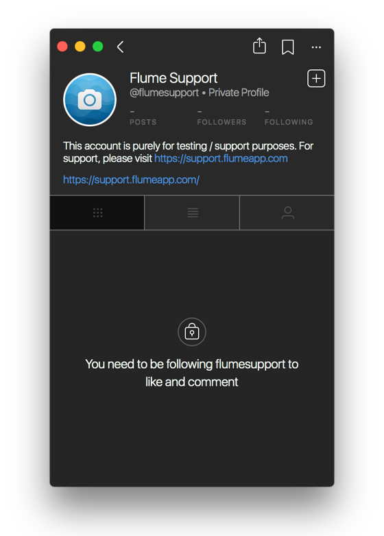

# Private Profiles

## Private Profiles

Private profiles allow you to manage who can see your posts. You do not need a private profile in order to manage who can message you, as all messages from users you do not follow appear as [message requests.](../conversations/#message-requests)

Conversely, private profiles that you do not follow will not display any information except for the name, biography, avatar and follower/following counts. It is not possible to view the followers/following of a private account you do not follow.

### Following a Private Profile

When requesting to follow a private profile, the user will be notified of your [friend request.](./#friend-requests)

If the user accepts your friend request, you will be notified in your [Activity.](../activity.md) If they ignore your request, you will not receive any notification.

### Switching to a Private Profile

To switch to a private profile:

* When viewing your [Profile](./), select the `Set Profile to Private` item under the [Settings](settings/)  button in the [title bar.](../../misc/glossary.md#title-bar)


[Business Profiles](businessprofiles/) cannot be made private.


### Switching to a Public Profile

To switch back to a public profile:

* When viewing your [Profile](./), select the `Set Profile to Public…` item under the [Settings](settings/)  button in the [title bar.](../../misc/glossary.md#title-bar)


All pending [friend requests](./#friend-requests) will be approved when switching to a public profile.


