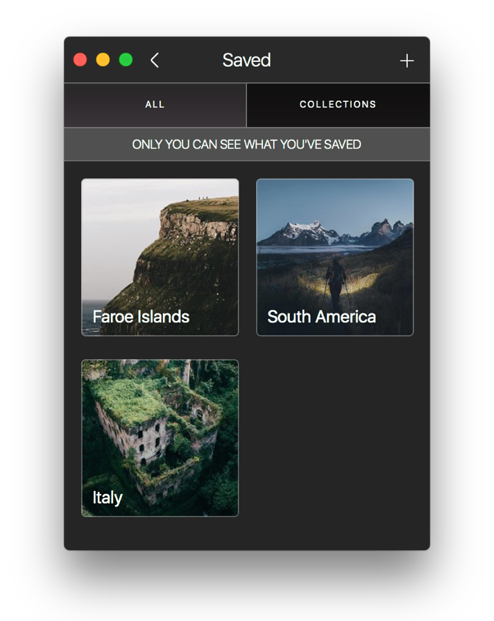
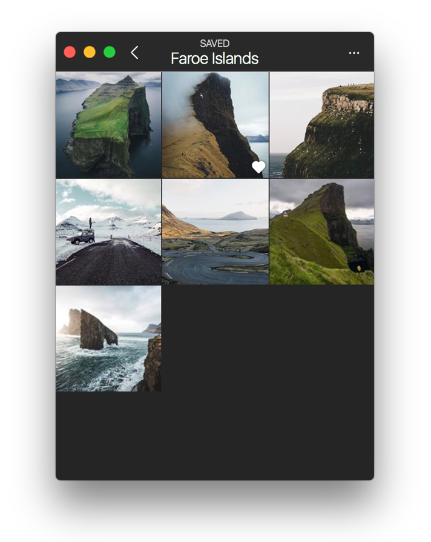

# Saved Collections

## Saved Collections

Saved Collections allow you to group your [Saved posts](./#saved-posts).

 

### Creating a Saved Collection

To create a new Saved Collection:

* Long-press the save  button wherever it appears next to a post, to display the Saved Collection popover.
* Right-click any post, then select `Save > Save to Collection…` from the [contextual menu.](../../misc/glossary.md#contextual-menu)
* When viewing the [Details](../detailview.md) of a post, use the `Save > Save to Collection…` [Menu Bar](../../misc/glossary.md#menu-bar) item.

When the Saved Collection popover appears, click the create  button to name your new collection.

### Saving to a Saved Collection

To save a new post to a saved collection:

* Long-press the save  button wherever it appears next to a post, to display the Saved Collections popover.
* Right-click any post, then select `Save > Save to Collection…` from the [contextual menu.](../../misc/glossary.md#contextual-menu)
* When viewing the [Details](../detailview.md) of a post, use the `Save > Save to Collection…` [Menu Bar](../../misc/glossary.md#menu-bar) item.

### Adding to a Saved Collection

To add posts you have previously saved to a Saved Collection:

* When viewing the saved posts in a Saved Collection, select the `Add to Collection…` item under the actions  button in the [title bar.](../../misc/glossary.md#title-bar)
* Right-click a Saved Collection, then select `Add to Collection…` from the [contextual menu.](../../misc/glossary.md#contextual-menu)
* When selecting the a Saved Collection via the [keyboard](../../misc/keyboard-shortcuts.md), use the `Collection > Add to Collection…` [Menu Bar](../../misc/glossary.md#menu-bar) item.

### Removing posts from a Saved Collection

To remove posts in a Saved Collection:

* Press the save  button wherever it appears next to a previously Saved Collection post. A confirmation dialog will ask if whether you would like to remove the saved post from the Saved Collection or all saved posts.

### Renaming a Saved Collection

To rename a Saved Collection:

* When viewing the saved posts in a Saved Collection, select the `Edit Collection…` item under the actions  button in the [title bar.](../../misc/glossary.md#title-bar)
* Right-click a Saved Collection, then select `Edit Collection…` item from the [contextual menu.](../../misc/glossary.md#contextual-menu)
* When selecting the a Saved Collection via the [keyboard](../../misc/keyboard-shortcuts.md), use the `Collection > Edit Collection…` [Menu Bar](../../misc/glossary.md#menu-bar) item.

### Deleting a Saved Collection

When deleting a Saved Collection, the saved posts will still remain saved.

To delete a Saved Collection:

* When viewing the saved posts in a Saved Collection, select the `Edit Collection…` item under the actions  button in the [title bar](../../misc/glossary.md#title-bar), then click `Delete Collection` from the editing options view.
* Right-click a Saved Collection, then select `Delete Collection…` item from the [contextual menu.](../../misc/glossary.md#contextual-menu)
* When selecting a Saved Collection via the [keyboard](../../misc/keyboard-shortcuts.md), use the `Collection > Delete Collection…` [Menu Bar](../../misc/glossary.md#menu-bar) item.

