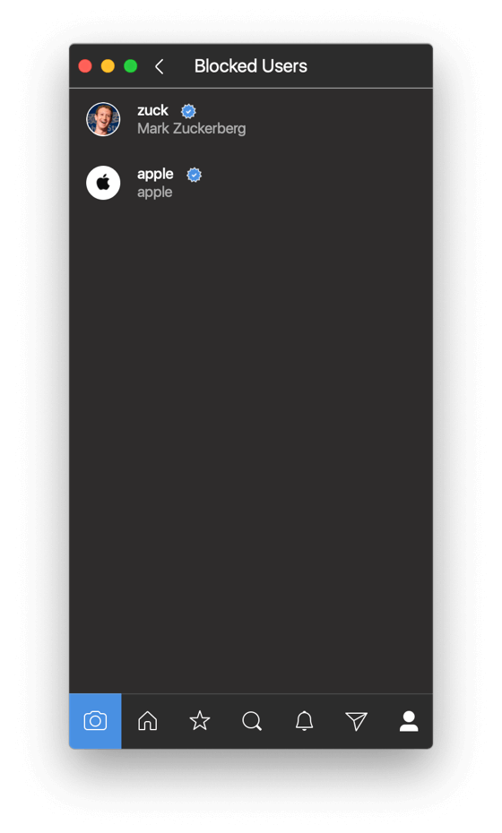

# Blocked Users

## Viewing Blocked Users

To view the list of blocked users:

* When viewing your own [profile](../), select the `Blocked Accounts…` item under the [settings](./)  button in the [title bar.](../../../misc/glossary.md#title-bar)

## Blocking / Unblocking Users

To block or unblock a user:

* Use the `User > [Block…|Report…]` [menu bar](../../../misc/glossary.md#menu-bar) item when viewing a [profile](../) or selecting a [message](../../conversations/messages.md), [post](../../detailview.md), or user in a list using [keyboard navigation.](../../../misc/keyboard-shortcuts.md)

