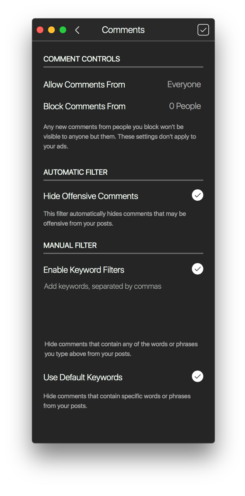

# Comment Controls

The comment controls view allows you to moderate and control the commenting behaviour on your posts.

### Viewing Comment Controls

To view your current comment controls:

* When viewing your own [profile](../), select the `Comment Controls…` item under the [settings](./)  button in the [title bar.](../../../misc/glossary.md#title-bar)

### Enabling / Disabling Comments on Posts

You can disable commenting on your posts by toggling the option when [uploading.](../../upload.md)

You can also toggle commenting from the [details view](../../detailview.md#comments) of existing posts.

