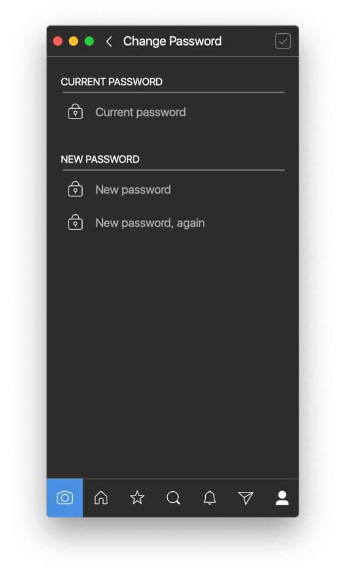

# Change Password

## Changing Your Password

To change your password:

* When viewing your own [profile](../), select the `Password…` item under the [settings](./)  button in the [title bar.](../../../misc/glossary.md#title-bar)


Changing your password will invalidate your logged in sessions elsewhere, such as the Instagram mobile apps or the website. If you change your password via a method other than Flume, the next time Flume connects to Instagram with your account, you will receive a `Session Timed Out` alert and be logged out.


