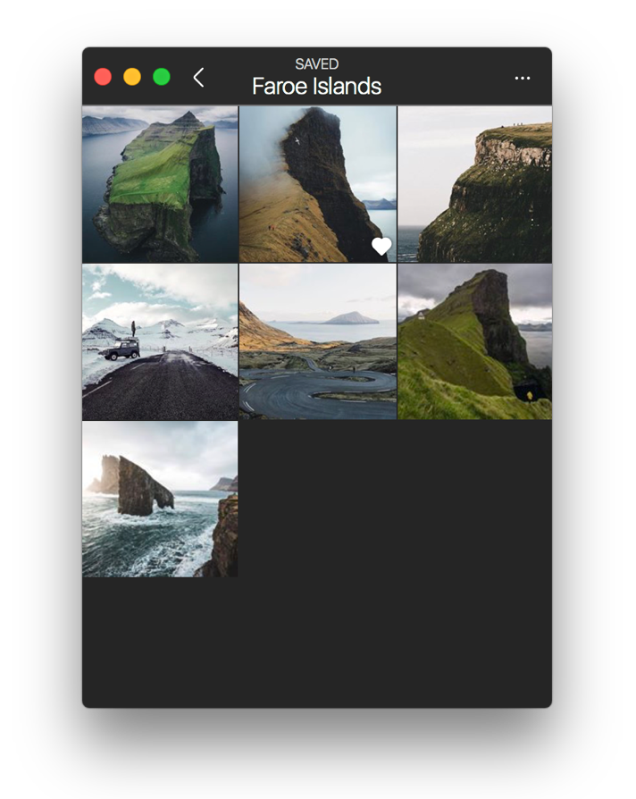

# Saved Collections

Saved collections allow you to organise your [saved posts](../#saved-posts) into groups.

 

## Creating a Saved Collection

To create a new saved collection:

* Long-press the save  button wherever it appears next to a post, to display the saved collection popover.
* Right-click any post, then select `Save > Save to Collection…` from the [contextual menu.](../../../misc/glossary.md#contextual-menu)
* When viewing the [details](../../detailview.md) of a post, use the `Save > Save to Collection…` [menu bar](../../../misc/glossary.md#menu-bar) item.

When the saved collection popover appears, click the create  button to name your new collection.

## Saving to a Saved Collection

To save a new post to a saved collection:

* Long-press the save  button wherever it appears next to a post, to display the saved collections popover.
* Right-click any post, then select `Save > Save to Collection…` from the [contextual menu.](../../../misc/glossary.md#contextual-menu)
* When viewing the [details](../../detailview.md) of a post, use the `Save > Save to Collection…` [Menu Bar](../../../misc/glossary.md#menu-bar) item.

## Adding to a Saved Collection

To add posts you have previously saved to a saved collection:

* When viewing the saved posts in a saved collection, select the `Add to Collection…` item under the actions  button in the [title bar.](../../../misc/glossary.md#title-bar)
* Right-click a saved collection, then select `Add to Collection…` from the [contextual menu.](../../../misc/glossary.md#contextual-menu)
* When selecting a saved collection via the [keyboard](../../../misc/keyboard-shortcuts.md), use the `Collection > Add to Collection…` [Menu Bar](../../../misc/glossary.md#menu-bar) item.

## Removing posts from a Saved Collection

To remove posts in a saved collection:

* Press the save  button wherever it appears next to a previously saved collection post. A confirmation dialog will ask if whether you would like to remove the saved post from the saved collection or all saved posts.

## Renaming a Saved Collection

To rename a saved collection:

* When viewing the saved posts in a saved collection, select the `Edit Collection…` item under the actions  button in the [title bar.](../../../misc/glossary.md#title-bar)
* Right-click a saved collection, then select `Edit Collection…` item from the [contextual menu.](../../../misc/glossary.md#contextual-menu)
* When selecting a saved collection via the [keyboard](../../../misc/keyboard-shortcuts.md), use the `Collection > Edit Collection…` [Menu Bar](../../../misc/glossary.md#menu-bar) item.

## Deleting a Saved Collection

When deleting a saved Collection, the saved posts will still remain in your saved posts.

To delete a saved collection:

* When viewing the saved posts in a saved collection, select the `Edit Collection…` item under the actions  button in the [title bar](../../../misc/glossary.md#title-bar), then click `Delete Collection` from the editing view.
* Right-click a saved collection, then select `Delete Collection…` item from the [contextual menu.](../../../misc/glossary.md#contextual-menu)
* When selecting a saved collection via the [keyboard](../../../misc/keyboard-shortcuts.md), use the `Collection > Delete Collection…` [Menu Bar](../../../misc/glossary.md#menu-bar) item.

