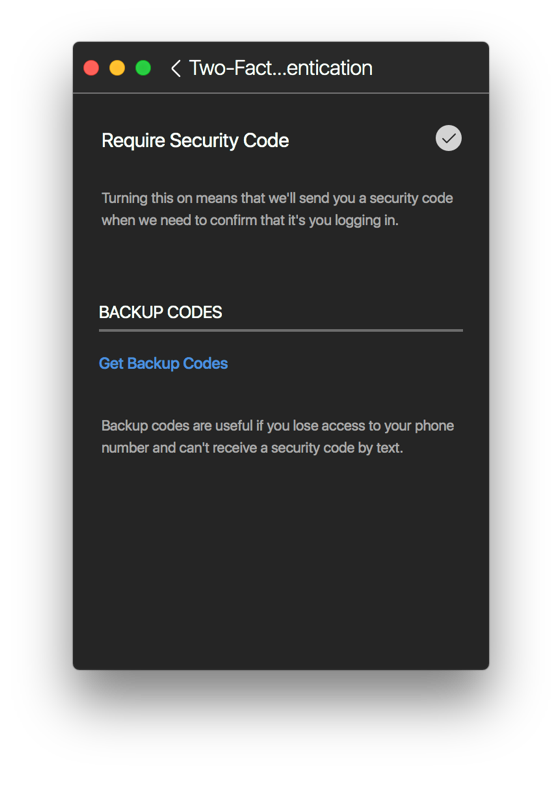
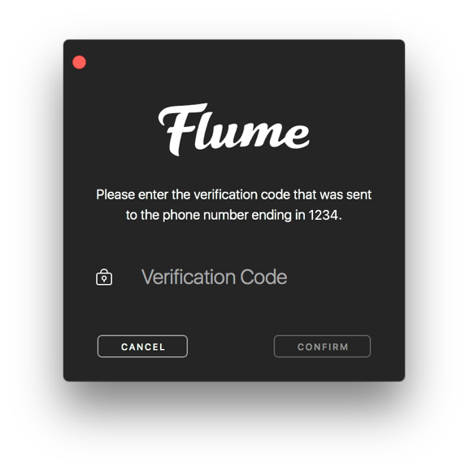

# Two-Factor Authentication

To protect your account, Flume provides support for Instagram's [Two-Factor Authentication. ](https://help.instagram.com/566810106808145) Whenever you or someone attempts to log in as you, an SMS verification code is sent to your phone to authorize the log in attempt.


Flume only supports SMS-based 2FA currently. Third-party 2FA authenticator apps are not supported at this stage.


  

## Enabling/Disabling Two-Factor Authentication

To enable/disable Two-Factor Authentication:

* When viewing your own [profile](../), select the `Two-Factor Authentication` item under the [settings](./)  button in the [title bar.](../../../misc/glossary.md#title-bar) 
* Click the enable  button and follow the prompts to verify your phone number.

## Request Backup Codes

If you are unable to access your phone, or receive SMS verification codes, you can use backup codes to gain access to your account. These codes are not specific to Flume and will be necessary should you try to log in from any new device.

To request your backup codes:

* When viewing your own [profile](../), select the `Two-Factor Authentication` item under the [settings](./)  button in the [title bar.](../../../misc/glossary.md#title-bar) 
* Click `Get Backup Codes` to see your backup codes. These codes can be copied and pasted into a secure document.

