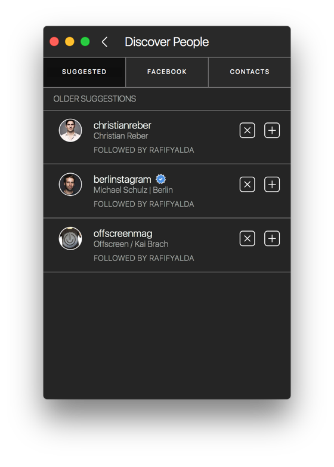
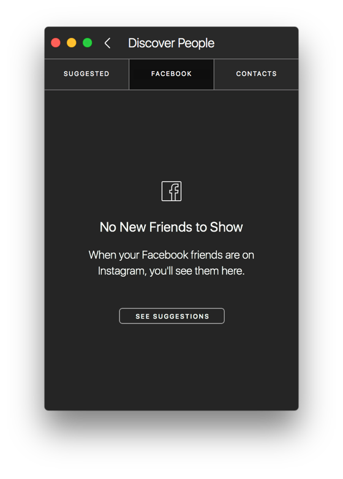
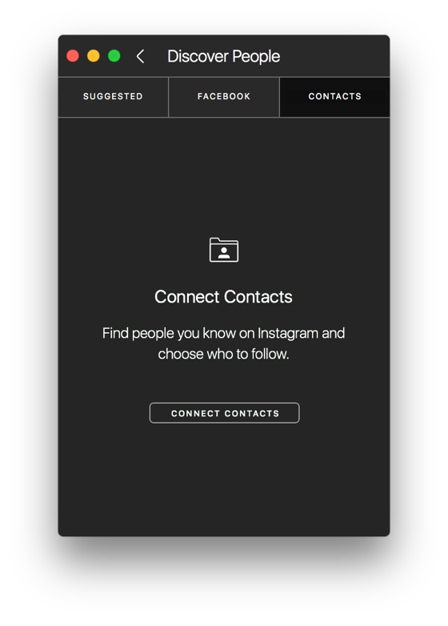

# Discover People

The Discover People view allows you to view suggestions for new accounts to follow from your Instagram activity, from accounts you are connected with on Facebook, and through your [address book.](settings/invitecontacts.md)

  

## Viewing your Discover People Suggestions

To view your follower suggestions:

* When viewing your [Profile](./), select the Find Contacts… item under the [Settings](settings/)  button in the [title bar.](../../misc/glossary.md#title-bar)

## Ignoring Suggestions

If you'd like to ignore a suggestion, click the ignore  button next to each suggestion.

