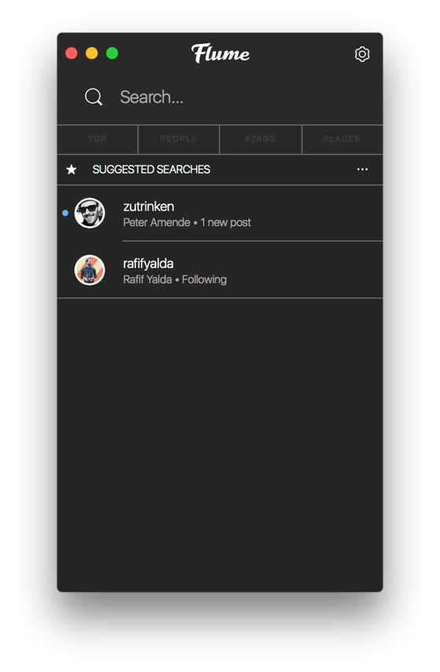
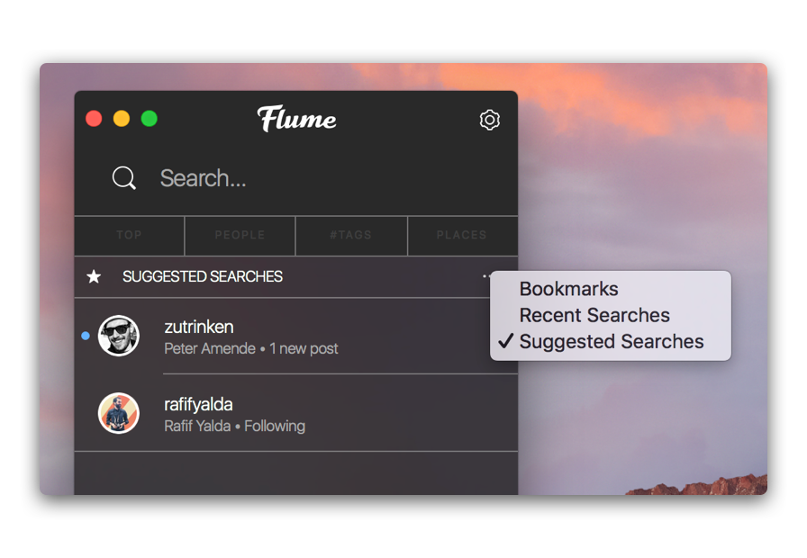
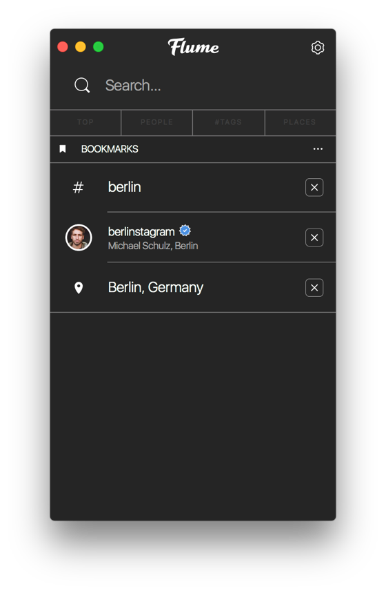
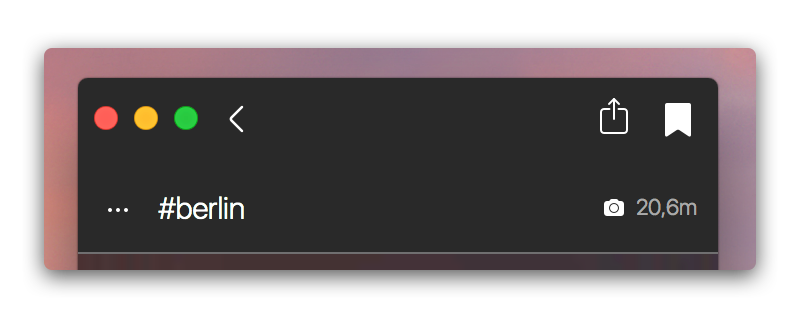
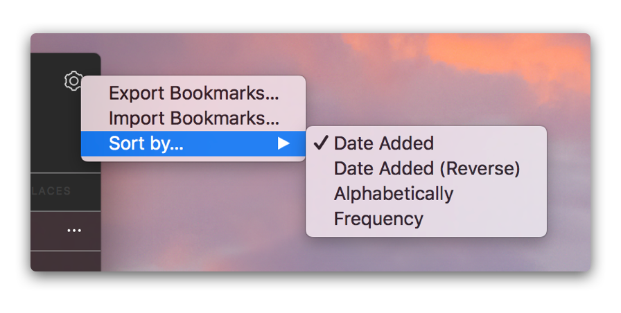
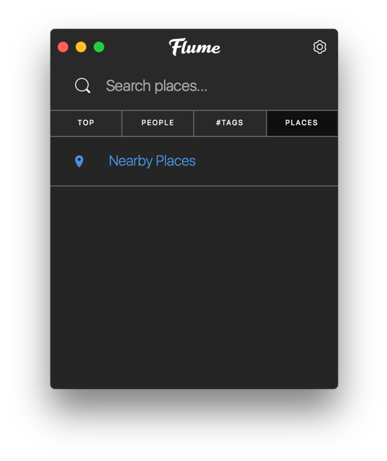

# Search

The search view allows you to find specific [profiles](profile/), [locations](locations.md) and [hashtags](hashtags.md), as well as quickly accessing previously saved search items via [search bookmarks](search.md#search-bookmarks).

## Switching Search Modes/Types

To switch between search types, simply click on the tab `Top`, `People`, `#Tags`, or `Places` button.

To switch between search modes, use the  menu when viewing the `Top` or `People` search types.

## Search Bookmarks

When viewing a [profile](profile/), [location](locations.md), or [hashtag](hashtags.md), you can add the item as a search bookmark, giving you quick access to it later from the search view.

### Adding / Removing Search Bookmarks

To toggle an item \([profile](profile/), [location](locations.md), or [hashtag](hashtags.md)\) as a search bookmark, perform one of the following actions:

* Click the bookmarks  button in the [title bar](../misc/glossary.md#title-bar) when viewing the details of a [profile](profile/), [location](locations.md), or [hashtag.](hashtags.md)

* Use the `View > [Add|Remove] "X" to Bookmarks` [menu bar](../misc/glossary.md#menu-bar) item.
* When viewing your list of search bookmarks, click the  button.

### Sorting Search Bookmarks

By default, search bookmarks are sorted in date added order. To change the ordering, use the `Sort by…` option under the  button in the [title bar.](../misc/glossary.md#title-bar)

### Importing / Exporting Search Bookmarks

To import or export your search bookmarks, use the `[Import|Export] Bookmarks…` option under the  button in the title bar, or under the `File > Bookmarks` [menu bar](../misc/glossary.md#menu-bar) item.

## Suggested Searches

If you do not have any [search bookmarks](search.md#bookmarks), the search view will default to showing you Instagram's suggestions.

We recommend you use Flume's [search bookmarks](search.md#bookmarks) feature to save commonly searched items, as suggested searches can change at any time based off various account-factors.

To remove a suggested search:

* Click the delete  button next to the suggested user, hashtag, or place you wish to remove.
* Right-click on a suggested user, hashtag, or place and select `Hide` from the [contextual menu.](../misc/glossary.md#contextual-menu)

## Recent Searches

Your recent searches are populated by Instagram based off your previous searches for that account. We recommend you use Flume's [search bookmarks](search.md#bookmarks) feature to save commonly searched items, as recent searches are limited by Instagram to just a few items.

To clear your recent searches, see [profile settings.](profile/settings/)

## Nearby Location Searches

To search locations that are near to you:

* Click the `Places` search type tab.
* If you have previously searched for a term, press the clear  button to remove the current search term.
* Click the `Nearby Places` row in the list of results.


You must allow Flume access to your location if you wish to use this feature. If you have previously disabled access, you can enable Location Services access via `System Preferences > Security Privacy > Privacy > Location Services.`


