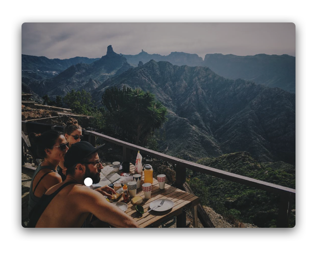

# Upload

The Upload window allows you upload photos and videos, write captions, tag users, set cover frames, crop and resize, share to [linked accounts](profile/settings/linkedaccounts.md) and much more.


Uploading is a [Flume Pro](../preferences/flumepro.md) feature.



Photos and videos must fit within certain [specifications](../misc/upload-specifications.md) to be accepted by Instagram.


## Creating Posts

To begin creating a new post:

* Click the upload  button in [Flume's toolbar menu.](../preferences/design.md#show-the-menu)  
* Use the `File > New Post…` Menu Bar item.
* Use the `View > Upload` Menu Bar item.
* Tap the upload  button in the [Touch Bar.](../misc/touchbar.md)
* Right-click on Flume's Dock icon and select the `Upload` item.
* Drag a photo/video directly onto Flume's Dock icon.
* Right-click a photo or video in Finder and select the `Open with… > Flume` menu item.

## Drafts

Flume has support for drafts through its own `.flume` document type. Drafts save the following information:

* The photos or videos to post.
* All [filters](upload.md#filters) and [adjustments.](upload.md#adjustments)
* The [caption.](upload.md#captions)
* The [tagged users.](upload.md#tagged-users)
* The [tagged location.](upload.md#tagged-locations)
* The [sharing options.](upload.md#sharing)
* The [advanced settings.](upload.md#advanced-settings)
* The [account](../preferences/accounts.md) to post to.

### Creating Drafts

To create/save a draft:

* After selecting your photo/video and making all necessary edits, close the upload window, or use the `File > Save Draft…` Menu Bar item. A save dialog will appear to select a save location and filename.


If you make edits to a previously opened draft, changes will be saved to the same draft file and no save dialog will appear.


### Opening Drafts

To open a draft:

* Open the draft file in Finder.
* Drag-and-drop the draft onto Flume's Dock icon.
* Drag-and-drop the draft onto an Upload window.
* Use the `File > Open Draft…` Menu Bar item.

### Previewing Drafts

Flume's drafts support [QuickLook](https://en.wikipedia.org/wiki/Quick_Look) and render previews of the photo or video in Finder.

## Carousel Posts

You can select up to 10 photos and videos into a single post, otherwise known as a [carousel or multi-post.](detailview.md#carousel-posts)

Carousel posts can be either all square items, all horizontal, or all vertical. It is not possible to mix-and-match square items with horizontal or vertical items. **Flume will use the aspect ratio of your first item in the Carousel Post, in order to force cropping of all subsequent items to the same aspect ratio.** If you wish to create a square Carousel Post from a photo or video that is not originally in square aspect ratio, you should first [crop the photo/video](upload.md#cropping---resizing) before toggling the Carousel Post option. If you drag-and-drop multiple files to create a Carousel Post, Flume will automatically display the cropping window for you for the first item.


When dragging/opening multiple files to create a Carousel Post, Flume will sort the selected files by **filename** to ascertain the order. The first item in your Carousel Post determines the kind of Carousel Post \(square / horizontal / vertical\) Flume will create. If you wish to override Flume's default filename ordering, select your first item for Upload manually, then add the remaining items after toggling from a [Single Post to a Carousel Post.](upload.md#converting-single-posts-to-carousel-posts) Once all items are added, rearrange them by hovering over the item thumbnail and drag-and-dropping them to a new position.


### Creating Carousel Posts

To create a Carousel Post directly:

* Select more than one photo/video in the macOS open panel that appears after choosing `Select Photo/Video/Draft…` in the Upload window.
* Drag more than one photo/video directly onto an empty Upload window.
* Drag more than one photo/video \(or a folder\) directly onto Flume's Dock icon.
* Right-click more than one photo/video in Finder and select the `Open with… > Flume` menu item.

### Converting Single Posts to Carousel Posts

To toggle between an individual and Carousel Post:

* Click the carousel  button.
* Use the `Upload > Toggle Carousel Post` Menu Bar item.
* Tap the carousel  button in the [Touch Bar.](../misc/touchbar.md)

## Editing

You can apply filters and make adjustments to your photos and videos easily right inside Flume.


Video filters and adjustments are not available on macOS Yosemite 10.10



The Scale adjustment is only available on photos.


#### Editing Photos/Videos

To edit a selected photo or video:

* Click the edit  button.
* Use the `Upload > Toggle Edit Options` Menu Bar item.
* Tap the edit  button in the [Touch Bar.](../misc/touchbar.md)

#### Previewing Edits

To quickly preview your edits:

* Click the preview  button.
* Tap the preview  button in the [Touch Bar.](../misc/touchbar.md)

### Filters

To apply a filter to a photo or video:

* Click on the filter preview.
* Tap on the filter preview in the [Touch Bar.](../misc/touchbar.md)
* Use the ← \(LEFT\) and → \(RIGHT\) [keyboard arrows.](../misc/keyboard-shortcuts.md)

After selecting a filter, you can adjust the its intensity \(default 100%\).


You can reorder and enable Flume's exclusive filters via [Upload Preferences.](../preferences/upload/filters.md)


### Adjustments

To make adjustments to a photo or video:

* Click and drag the respective slider to set a new value.
* Use the ↑ \(UP\) and ↓ \(DOWN\) [keyboard arrows](../misc/keyboard-shortcuts.md) to move between adjustments, and ← \(LEFT\) and → \(RIGHT\) to set their value.

The Color adjustment requires you to first select a color to apply as an overall tint to the photo or video.

The Tilt Shift adjustment requires you to set the two focal points. Click the Adjust button and follow the prompts to set the points on the photo or video.

#### Resetting Adjustments

To reset all adjustments:

* Click the clear  button.

## Captions

You can add an optional caption to your posts. When typing a `#` or `@` character, your keyboard input will also search Instagram for matching hashtags and users until you select an item from the popover, press the `ESC` key, or press another space.


[Limits apply](../misc/limits.md) to the length of the caption, the number of hashtags, and mentions.


## Tagged Users

You can include up to 30 users to tag in a photo. The tagged users can be viewed in the [Details View](detailview.md#tagged-users).

 


Only photos can contain tagged users.


### Adding Tagged Users

To add a tagged user in a photo:

1. Click the tagged users  button on the photo, or tap the button in the [Touch Bar.](../misc/touchbar.md)
2. Click a position in the photo where the user is located.
3. Type in the search text field to find the relevant user.
4. Click on a search result to confirm the user tag.

### Removing Tagged Users

To remove a tagged user:

1. Click the tagged users  button on the photo, or tap the button in the [Touch Bar.](../misc/touchbar.md)
2. Hover the mouse over the user tag you wish to remove and click it once.

### Repositioning Tagged Users

To reposition a tagged user:

1. Click the tagged users  button on the photo, or tap the button in the [Touch Bar.](../misc/touchbar.md)
2. Hover the mouse over the user tag you wish to remove and click-and-drag it to a new position.

## Tagged Locations

You can tag your photo and video at a location that displays in the [Details View](detailview.md) and links to the [recent media tagged at that location.](locations.md)

### Adding Tagged Locations

To add a location on a photo or video:

1. Click the `Add Location` button, or tap the location  button in the [Touch Bar.](../misc/touchbar.md)
2. Type to search for the location to tag, or click the `Nearby Places`  button to search locations close to your current position.
3. Select a location from the search results. If no search results could be found, the results popover will disappear.


If the photo or video contains [geotag](https://en.wikipedia.org/wiki/Geotagging) location information, Flume will automatically search for the GPS coordinates where the photo or video was taken. You cannot tag exact GPS coordinates on Instagram, and all tagged locations must exist as Facebook Places. To add new locations, see [Instagram's Help Center.](https://help.instagram.com/1618893218361276)


### Editing Tagged Locations

To edit a location on a photo or video:

* Click the name of the location, and select the `Edit Location` item.
* Tap the edit location  button in the [Touch Bar.](../misc/touchbar.md)

### Removing Tagged Locations

To remove an existing location on a photo or video:

* Click the name of the location, and select the `Remove Location` item.
* Tap the remove location  button in the [Touch Bar.](../misc/touchbar.md)

## Cover Image

When uploading a video, you can choose a custom cover image that will be used to represent your video's thumbnail image.

To set a cover image:

* Click the cover image  button.
* Use the `Upload > Select a Cover Image…` Menu Bar item.
* Tap the cover image  button in the [Touch Bar.](../misc/touchbar.md)

Use the video scrubber in the cover image view or [Touch Bar](../misc/touchbar.md) to select a position in the video as the cover image.


By default, Flume will use the frame at 0.5 seconds into your video as your cover image. If your video contains a solid colour fade-in transition, your cover image will be the solid colour. To avoid this, set a custom cover image.


## Cropping / Resizing

### Photos

When you select a photo to upload that exceeds the [aspect ratio requirements](../misc/upload-specifications.md), you have three options:

* Scroll the photo's cropping region to a desired area using your mouse/trackpad. The region of the photo not visible will be cropped from the upload.
* [Crop a region of the photo](upload.md#cropping-photos) so that it falls within the aspect ratio requirements.
* [Resizing the photo to fit into a square](upload.md#resizing-photos-to-fit), with an optional custom border colour.

#### Cropping Photos

To crop a photo:

* Click the crop  button.
* Use the `Upload > Crop…` Menu Bar item.
* Tap the crop  button in the [Touch Bar.](../misc/touchbar.md)

Click-and-drag the resize handles to adjust the cropping region, and click-and-drag the rectangle to adjust the cropping position.


You can toggle between forcing a square or freeform cropping region by clicking the the 1:1 button.


#### Resizing Photos

To resize a photo back to its original dimensions:

* Click the resize  button.
* Use the `Upload > Resize to Original` Menu Bar item.
* Tap the resize  button in the [Touch Bar.](../misc/touchbar.md)

#### Resizing Photos to Fit

If your selected photo exceeds the [aspect ratio requirements](../misc/upload-specifications.md), you can use the Resize to Fit option to resize the entire photo to fit inside a square, with the ability to also choose a custom border color.

This ensures your landscape or portrait photos will not be cropped.

### Videos

When you select a video to upload that exceeds the [aspect ratio requirements](../misc/upload-specifications.md), you have three options:

* Scroll the video's cropping region to a desired area using your mouse/trackpad. The region of the video not visible will be cropped from the upload, and the original aspect ratio will be maintained.
* [Crop a region of the video](upload.md#cropping-videos) so that it falls within the aspect ratio requirements.
* Resizing the video to fit into a square. Like above, scroll the video's cropping region to a desired area using your mouse/trackpad. The region of the video not visible will be cropped from the upload, and a 1:1 \(square\) aspect ratio will be maintained.


When selecting a video that is already 1:1 \(square\), the options to crop or resize will be disabled.

It is not currently possible to resize videos to fit, [unlike photos.](upload.md#resizing-photos-to-fit)


#### Cropping Videos

To crop a video:

* Click the crop  button.
* Use the `Upload > Crop…` Menu Bar item.
* Tap the crop  button in the [Touch Bar.](../misc/touchbar.md)

Click-and-drag the resize handles to adjust the cropping region, and click-and-drag the rectangle to adjust the cropping position.


If you wish to constrain the cropping region to 1:1 aspect ratio, hold down the SHIFT key while click-and-dragging.


#### Resizing Videos

To resize a video back to its original dimensions:

* Click the resize  button.
* Use the `Upload > Resize to Original` Menu Bar item.
* Tap the resize  button in the [Touch Bar.](../misc/touchbar.md)

## Sharing

### Sharing to Your Favorites/Close Friends

To share a post to your [Favorites](profile/favorites.md) / close friends:

* Click the Share to Favorites  button.
* Use the `Upload > Share > Share to Favorites` Menu Bar item.


If you enable sharing to your Favorites, [sharing to a Linked Account](upload.md#sharing-to-linked-accounts) is disabled.


### Sharing to Linked Accounts

Sharing allows you to cross-post your upload to a [linked account.](profile/settings/linkedaccounts.md) You can also [share existing posts](sharing.md) at any time.

To share a post to a linked account:

* Click the Share  button.
* Use the `Upload > Share > Linked Account` Menu Bar item.

Choose at least one social network to share to.


You can also save your sharing options, so that the previously enabled options are remembered for your next upload.


## Advanced Settings

To adjust advanced settings on your post:

* Click the Settings  button.


You can also [disable comments after posting.](detailview.md#enabling--disabling-comments)


## Switching Accounts

To switch the account to post with:

* Click on the profile picture and select an account.
* Use the `Accounts` Menu Bar item.

## Export Edits

If you are a [Flume Pro](../preferences/flumepro.md) user, you can use Flume to edit your photos and videos, adding filters and fine-tuning with adjustments, but export the items for use elsewhere without uploading to Instagram.

To export your edited items:

* Click on the actions  button in the titlebar area of the Upload window, and select the `Export Edits…` menu item.
* Use the `Upload > Export Edits…` Menu Bar item.

A dialog will appear asking you to choose the location to export your items.

## Sync All Upload Windows

If you need to post some items in a series, such as 3 photos in a row with the same theme, you can make use of the unique sync all upload windows feature, which will copy and replace the caption, location, tagged users, sharing settings, and advanced settings to all currently open upload windows. This allows you to write and set the details once, and apply it to all the other open upload windows instantly.

To sync all upload windows:

* Click on the actions  button in the titlebar area of the Upload window, and select the `Sync All Upload Windows…` menu item.
* Use the `Upload > Sync All Upload Windows…` Menu Bar item.

